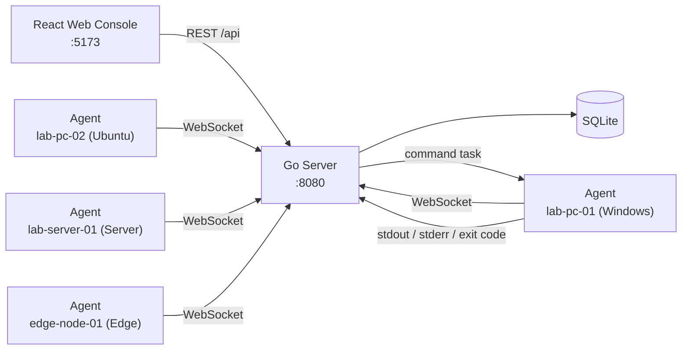

# LabOps

**Lightweight Open-Source Operations Platform for Labs & Homelabs**

[](https://github.com/cowhorse05/LabOps/actions/workflows/ci.yml)
[](https://go.dev/)
[](LICENSE)
[]()
[]()

---

## Overview

LabOps is a lightweight, open-source operations console built for students, classroom labs, homelab enthusiasts, and small IT teams. It provides a real agent-server-web loop — agents report inventory and heartbeat data, receive commands, return results, and leave a full audit trail — all from a single Docker Compose command on one machine.

> LabOps is not trying to replace mature RMM or monitoring platforms. It is a readable, runnable full-stack project that demonstrates a real operations control loop with minimal dependencies. No mock data, no external database — just SQLite, Go, and React.

---

## Features

- **Real Agent/Server/Web loop** — agents register, heartbeat, execute commands, and report results; no mock data
- **Dashboard** — real-time device stats, online rates, and recent task/audit summaries with 10-second auto-refresh
- **Device management** — searchable device list with detail view, live metrics (CPU/memory/disk), and heartbeat tracking
- **Command execution** — run commands on any device and capture stdout, stderr, exit code, and duration
- **Group-based batch dispatch** — send commands to every device in a group with a single click
- **AI Ops** — intelligent health scoring (0-100) with threshold-based alerts for CPU, memory, disk, and offline events
- **Full audit trail** — every registration, connection, command dispatch, and result is recorded and searchable
- **Docker Compose demo** — spin up the server, web console, and 4 simulated agents with different profiles in one command
- **Agent token auth** — bcrypt-hashed passwords, Bearer token authentication, and rate limiting on login
- **SQLite database** — zero configuration, single file, no external database required
- **57 Go test functions** — 50 server + 7 agent, all passing, with 72.3% core coverage
- **WebSocket real-time communication** — persistent bidirectional channel between server and agents
- **Modern React UI** — Ant Design 5 + TypeScript + Zustand + Vite
- **GitHub Actions CI** — Go vet, test, and TypeScript check/build on every push

---

## Quick Start

### Prerequisites

- Windows 10/11 + PowerShell
- [Docker Desktop](https://www.docker.com/products/docker-desktop/) (or Podman)
- [Node.js](https://nodejs.org/) 20+ (for local web development)
- Go 1.23+ (optional — Go builds and tests can run inside Docker)

### 3-Step Getting Started

```powershell
# 1. Clone the repository
git clone https://github.com/cowhorse05/LabOps.git
cd LabOps

# 2. Launch the full demo stack
.\scripts\dev.ps1

# 3. Open your browser
# → http://localhost:5173
```

The first build takes 2-3 minutes as Docker pulls and builds images. Once ready, the compose environment starts the server, web console, and 4 simulated agents.

### Stop the Stack

```powershell
.\scripts\compose-down.ps1
```

### Demo Credentials

```text
Username: admin
Password: admin
```

> The default credentials use bcrypt hashing at rest. For production use, change the admin password and rotate the agent/web tokens via environment variables.

### Run Verification Checks

```powershell
.\scripts\test.ps1
```

---

## Architecture



### Data Flow

```text
 Agent ──WebSocket──▶  Server  ◀──REST API──▶  Web Console
   │                      │                        │
   │  register            │  UpsertDevice          │  GET /api/devices
   │  heartbeat (10s)     │  UpdateHeartbeat       │  POST /api/tasks
   │  task_result         │  CompleteTask          │  GET /api/aiops/report
   │                      │  CreateAudit           │
                          │
                          ▼
                      SQLite
```

### WebSocket Protocol

All messages use the JSON envelope format: `{"type": "<type>", "payload": {...}}`.

| Direction | Type | Description | Frequency |
|-----------|------|-------------|-----------|
| Agent to Server | `register` | Device registration with full profile | On connect |
| Agent to Server | `heartbeat` | Heartbeat + live metrics (CPU/mem/disk) | Every 10s |
| Agent to Server | `task_result` | Command stdout, stderr, exit code, duration | On completion |
| Server to Agent | `registered` | Registration confirmation with device ID | After register |
| Server to Agent | `command` | Command dispatch with task ID | On task creation |
| Server to Agent | `error` | Error notification | On failure |

---

## API Overview

Base URL: `http://localhost:8080/api`

| Method | Path | Auth | Description |
|--------|------|:----:|-------------|
| `GET` | `/health` | - | Health check |
| `POST` | `/auth/login` | - | Login, returns JWT + user |
| `GET` | `/auth/me` | Bearer | Current authenticated user |
| `GET` | `/stats` | Bearer | Device statistics (total, online, offline) |
| `GET` | `/devices` | Bearer | List all registered devices |
| `GET` | `/devices/{id}` | Bearer | Get device detail with live metrics |
| `GET` | `/devices/{id}/tasks` | Bearer | List tasks for a specific device |
| `GET` | `/groups` | Bearer | List groups with online/total counts |
| `GET` | `/tasks` | Bearer | List tasks with results (limit 200) |
| `POST` | `/tasks` | Bearer | Create task: `{deviceId?, groupName?, command}` |
| `GET` | `/tasks/{id}` | Bearer | Get task detail with result |
| `GET` | `/audit-logs` | Bearer | List audit log entries (limit 200) |
| `GET` | `/aiops/report` | Bearer | AI Ops health analysis report |
| `GET` | `/agent/ws?token=...` | Query | WebSocket upgrade for agents |

**Authentication:** Web API requests use the `Authorization: Bearer <token>` header. Agent WebSocket connections pass the token as a query parameter.

---

## Tech Stack

| Layer | Technology | Version |
|-------|-----------|---------|
| Frontend | React + TypeScript + Vite | 18 / 5.x / 6.x |
| UI Library | Ant Design | 5.x |
| State | Zustand | 5.x |
| Backend | Go stdlib `net/http` | 1.25 |
| WebSocket | gorilla/websocket | v1.5.3 |
| Database | SQLite (modernc — pure Go) | - |
| Agent | Go + gorilla/websocket | 1.23 |

---

## Project Structure

```text
LabOps/
├── web/                         # React frontend
│   └── src/
│       ├── api/                 # Axios client + API functions
│       ├── components/          # Shared components (ErrorBoundary)
│       ├── hooks/               # Custom hooks (useLoadable, useLoadableAll)
│       ├── layouts/             # AppLayout (sidebar + header + content)
│       ├── pages/               # 8 pages
│       │   ├── LoginPage        #   Authentication
│       │   ├── DashboardPage    #   Overview with stats & charts
│       │   ├── DevicesPage      #   Device list with search
│       │   ├── DeviceDetailPage #   Device info + command execution
│       │   ├── GroupsPage       #   Group management
│       │   ├── TasksPage        #   Batch commands + task history
│       │   ├── AuditPage        #   Audit log browser
│       │   └── AiOpsPage        #   AI Ops health analysis
│       ├── stores/              # Zustand stores (auth)
│       ├── styles/              # Global CSS
│       ├── utils/               # Status helpers (statusColor, statusText)
│       └── types.ts             # TypeScript type definitions
├── server/                      # Go backend
│   └── internal/core/
│       ├── types.go             # Domain types + constants + wire protocol
│       ├── store.go             # SQLite CRUD (6 tables)
│       ├── app.go               # HTTP routes + middleware + maintenance loop
│       ├── api.go               # REST handlers (14 endpoints)
│       ├── agent.go             # WebSocket handler
│       ├── analyzer.go          # AI Ops analysis engine
│       ├── store_test.go        # Storage layer tests
│       ├── api_test.go          # HTTP handler tests
│       ├── agent_test.go        # WebSocket integration tests
│       └── analyzer_test.go     # Analyzer tests
├── agent/                       # Go agent
│   └── cmd/agent/
│       ├── main.go              # Agent main logic (connect, heartbeat, execute)
│       └── main_test.go         # Agent tests
├── docs/                        # Documentation
│   ├── master-plan.md           # Project plan SSOT
│   ├── user-manual.md           # End-user guide
│   ├── product-plan.md          # Product positioning
│   ├── research.md              # Competitive research
│   ├── roadmap.md               # Version roadmap
│   ├── dev-log.md               # Development log
│   ├── log.md                   # Changelog
│   ├── report.md                # Project report
│   └── features/
│       └── file-distribution/   # v0.3 file distribution design spec
├── scripts/                     # PowerShell development scripts
│   ├── dev.ps1                  # Full stack launch
│   ├── test.ps1                 # Build checks + Go tests
│   └── compose-down.ps1         # Teardown
├── compose.yaml                 # Docker Compose (6 containers)
└── README.md
```

---

## Documentation

- [Master Plan](docs/master-plan.md) — Project roadmap, architecture decisions, and implementation status
- [User Manual](docs/user-manual.md) — End-user guide covering all 8 pages and demo scenarios
- [Changelog](docs/log.md) — Detailed change history by round
- [Research](docs/research.md) — Competitive analysis of MeshCentral, Tactical RMM, Fleet, Zabbix/Netdata
- [Roadmap](docs/roadmap.md) — Version roadmap and planned features
- [File Distribution Spec](docs/features/file-distribution/design.md) — v0.3 design document for file push capabilities

---

## Contributing

Contributions are welcome. Please open an issue to discuss proposed changes before submitting a pull request. The project follows a Windows-first development workflow with PowerShell scripts for all tooling.

Areas where contributions would be especially valuable:

- Additional agent mock profiles
- C++ agent implementation (planned for v0.4)
- File distribution feature implementation (design spec ready)
- Dashboard data visualization improvements
- Test coverage expansion

---

## License

LabOps is licensed under the [MIT License](LICENSE).

---

## Acknowledgments

LabOps draws inspiration from several excellent open-source operations and monitoring platforms:

- [MeshCentral](https://github.com/Ylianst/MeshCentral) — agent architecture and remote management patterns
- [Tactical RMM](https://github.com/amidaware/tacticalrmm) — task execution and audit trail design
- [Fleet](https://github.com/fleetdm/fleet) — device inventory and grouping models
- [Zabbix](https://github.com/zabbix/zabbix) and [Netdata](https://github.com/netdata/netdata) — monitoring and health scoring concepts
