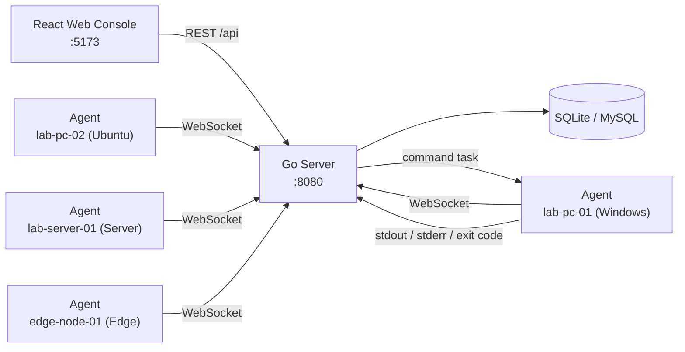

# LabOps

**Lightweight Open-Source Operations Platform for Labs & Homelabs**

[](https://github.com/cowhorse05/LabOps/actions/workflows/ci.yml)
[](https://go.dev/)
[](LICENSE)
[]()
[]()

---

[**中文文档**](#中文文档-chinese-documentation) | [**English Documentation**](#overview)

---

## Overview

LabOps is a lightweight, open-source operations console built for students, classroom labs, homelab enthusiasts, and small IT teams. It provides a real agent-server-web loop — agents report inventory and heartbeat data, receive commands, return results, and leave a full audit trail — all from a single Docker Compose command on one machine.

> LabOps is not trying to replace mature RMM or monitoring platforms. It is a readable, runnable full-stack project that demonstrates a real operations control loop with minimal dependencies. No mock data, no external database — just SQLite, Go, and React.

---

## Features

- **Real Agent/Server/Web loop** — agents register, heartbeat, execute commands, and report results; no mock data
- **Dashboard** — real-time device stats, online rates, and recent task/audit summaries with 10-second auto-refresh
- **Device management** — searchable device list with detail view, live metrics (CPU/memory/disk), and heartbeat tracking
- **Command execution** — run commands on any device and capture stdout, stderr, exit code, and duration
- **Group-based batch dispatch** — send commands to every device in a group with a single click
- **AI Ops** — intelligent health scoring (0-100) with threshold-based alerts for CPU, memory, disk, and offline events
- **Full audit trail** — every registration, connection, command dispatch, and result is recorded and searchable
- **Docker Compose demo** — spin up the server, web console, and 4 simulated agents with different profiles in one command
- **Agent token auth** — bcrypt-hashed passwords, Bearer token authentication, and rate limiting on login
- **SQLite database** — zero configuration, single file, no external database required
- **57 Go test functions** — 50 server + 7 agent, all passing, with 72.3% core coverage
- **WebSocket real-time communication** — persistent bidirectional channel between server and agents
- **Modern React UI** — Ant Design 5 + TypeScript + Zustand + Vite
- **GitHub Actions CI** — Go vet, test, and TypeScript check/build on every push

---

## Quick Start

### Prerequisites

| Platform | Requirements |
|----------|-------------|
| **Windows** | PowerShell 5+, Docker Desktop or Podman |
| **Linux** | bash, Docker Engine or Podman |
| **Both** | Node.js 20+ (for local dev), Go 1.23+ (optional — builds run inside Docker) |

### 3-Step Getting Started

**Windows (PowerShell):**

```powershell
# 1. Clone the repository
git clone https://github.com/cowhorse05/LabOps.git
cd LabOps

# 2. Launch the full demo stack
.\scripts\dev.ps1        # Docker Desktop
# or for Podman:
# .\scripts\dev.ps1      # (auto-detected if podman-compose is installed)

# 3. Open your browser → http://localhost:5173
```

**Linux / macOS (bash):**

```bash
# 1. Clone the repository
git clone https://github.com/cowhorse05/LabOps.git
cd LabOps

# 2. Launch the full demo stack
./scripts/dev.sh         # auto-detects docker or podman

# 3. Open your browser → http://localhost:5173
```

The first build takes 2-3 minutes as container images are pulled and built. Once ready, the compose environment starts the server, web console, and 4 simulated agents.

### Stop the Stack

**Windows:** `.\scripts\compose-down.ps1`
**Linux:** `./scripts/compose-down.sh`

### Demo Credentials

```text
Username: admin
Password: admin
```

> On first login you will be prompted to change the password. The default credentials use bcrypt hashing at rest. For production use, change the admin password and rotate the agent/web tokens via environment variables.

### Run Verification Checks

```powershell
.\scripts\test.ps1
```

---

## Production Deployment

### Option 1: Container Compose (cross-platform)

The same `compose.yaml` used for development works for production — just customize your tokens in `.env` first:

```bash
# Copy and edit environment variables
cp .env.example .env
# Edit .env to change LABOPS_AGENT_TOKEN and LABOPS_WEB_TOKEN

# Deploy (auto-detects docker or podman)
./scripts/deploy.sh --mode compose     # Linux
.\scripts\deploy.ps1 -Mode compose     # Windows
```

### Option 2: Native Deployment (Linux)

For bare-metal Linux servers without Docker:

```bash
# Auto-install dependencies and deploy with systemd
sudo ./scripts/deploy.sh --mode native --install-deps

# Start services
sudo systemctl start labops-server
sudo systemctl start labops-agent@my-workstation

# Web UI: http://YOUR-SERVER:8080
# Serve the React frontend with nginx or Caddy pointing to web/dist/
```

What this does:
1. Installs Go and Node.js via your package manager
2. Compiles the server and agent into static binaries (`CGO_ENABLED=0`)
3. Builds the React frontend into `web/dist/`
4. Creates a `labops` system user, data directory at `/var/lib/labops`
5. Installs systemd unit files for the server and agent template

**Customization:**

| File | Purpose |
|------|---------|
| `/etc/labops/env` | Server environment variables (tokens, DB path) |
| `/etc/systemd/system/labops-server.service` | Server systemd unit |
| `/etc/systemd/system/labops-agent@.service` | Agent template unit |

### Option 3: Native Deployment (Windows)

```powershell
# Build binaries + web frontend
.\scripts\deploy.ps1 -Mode native -InstallDeps

# Run directly
& "$env:ProgramFiles\LabOps\labops-server.exe"
& "$env:ProgramFiles\LabOps\labops-agent.exe" --server=http://localhost:8080 --token=<token> --id=my-pc --name=my-pc
```

For production Windows services, install [NSSM](https://nssm.cc/) and wrap the server/agent executables.

### Database Configuration

LabOps supports **SQLite** (default) and **MySQL 8.0+** databases.

#### SQLite (Default)

No configuration required. The database file is created automatically at the path specified by `LABOPS_DB_PATH`.

#### MySQL

To use MySQL instead of SQLite, set these environment variables before starting the server:

```env
LABOPS_DB_DRIVER=mysql
LABOPS_MYSQL_DSN=root:password@tcp(127.0.0.1:3306)/labops?parseTime=true&charset=utf8mb4
```

**Prerequisites:**
- MySQL 8.0+ must be installed and running
- The target database will be created automatically on first startup (requires `CREATE DATABASE` privilege)
- The user specified in the DSN needs `CREATE TABLE`, `INSERT`, `UPDATE`, `DELETE`, `SELECT` privileges

**Non-standard port example (Windows MySQL on port 3307):**

```env
LABOPS_MYSQL_DSN=root:123456@tcp(127.0.0.1:3307)/labops?parseTime=true&charset=utf8mb4
```

### Environment Variables

| Variable | Default | Description |
|----------|---------|-------------|
| `LABOPS_ADDR` | `:8080` | Server listen address |
| `LABOPS_DB_DRIVER` | `sqlite` | Database driver: `sqlite` or `mysql` |
| `LABOPS_DB_PATH` | `data/labops.db` | SQLite database file path |
| `LABOPS_MYSQL_DSN` | `labops:labops@tcp(127.0.0.1:3306)/labops?...` | MySQL Data Source Name |
| `LABOPS_AGENT_TOKEN` | `dev-agent-token` | Token agents use to connect via WebSocket |
| `LABOPS_WEB_TOKEN` | `dev-token` | Static bearer token for API access |
| `LABOPS_HEARTBEAT_TIMEOUT` | `35s` | Mark device offline after this duration |
| `LABOPS_TASK_TIMEOUT` | `2m` | Timeout running tasks |
| `VITE_PROXY_TARGET` | `http://localhost:8080` | Vite dev server API proxy target |

---

## Architecture



### Data Flow

```text
 Agent ──WebSocket──▶  Server  ◀──REST API──▶  Web Console
   │                      │                        │
   │  register            │  UpsertDevice          │  GET /api/devices
   │  heartbeat (10s)     │  UpdateHeartbeat       │  POST /api/tasks
   │  task_result         │  CompleteTask          │  GET /api/aiops/report
   │                      │  CreateAudit           │
                          │
                          ▼
                   SQLite / MySQL
```

### WebSocket Protocol

All messages use the JSON envelope format: `{"type": "<type>", "payload": {...}}`.

| Direction | Type | Description | Frequency |
|-----------|------|-------------|-----------|
| Agent to Server | `register` | Device registration with full profile | On connect |
| Agent to Server | `heartbeat` | Heartbeat + live metrics (CPU/mem/disk) | Every 10s |
| Agent to Server | `task_result` | Command stdout, stderr, exit code, duration | On completion |
| Server to Agent | `registered` | Registration confirmation with device ID | After register |
| Server to Agent | `command` | Command dispatch with task ID | On task creation |
| Server to Agent | `error` | Error notification | On failure |

---

## API Overview

Base URL: `http://localhost:8080/api`

| Method | Path | Auth | Description |
|--------|------|:----:|-------------|
| `GET` | `/health` | - | Health check |
| `POST` | `/auth/login` | - | Login, returns JWT + user |
| `GET` | `/auth/me` | Bearer | Current authenticated user |
| `GET` | `/stats` | Bearer | Device statistics (total, online, offline) |
| `GET` | `/devices` | Bearer | List all registered devices |
| `GET` | `/devices/{id}` | Bearer | Get device detail with live metrics |
| `GET` | `/devices/{id}/tasks` | Bearer | List tasks for a specific device |
| `GET` | `/groups` | Bearer | List groups with online/total counts |
| `GET` | `/tasks` | Bearer | List tasks with results (limit 200) |
| `POST` | `/tasks` | Bearer | Create task: `{deviceId?, groupName?, command}` |
| `GET` | `/tasks/{id}` | Bearer | Get task detail with result |
| `GET` | `/audit-logs` | Bearer | List audit log entries (limit 200) |
| `GET` | `/aiops/report` | Bearer | AI Ops health analysis report |
| `GET` | `/agent/ws?token=...` | Query | WebSocket upgrade for agents |

**Authentication:** Web API requests use the `Authorization: Bearer <token>` header. Agent WebSocket connections pass the token as a query parameter.

---

## Tech Stack

| Layer | Technology | Version |
|-------|-----------|---------|
| Frontend | React + TypeScript + Vite | 18 / 5.x / 6.x |
| UI Library | Ant Design | 5.x |
| State | Zustand | 5.x |
| Backend | Go stdlib `net/http` | 1.25 |
| WebSocket | gorilla/websocket | v1.5.3 |
| Database | SQLite (modernc — pure Go) | - |
| Agent | Go + gorilla/websocket | 1.23 |

---

## Project Structure

```text
LabOps/
├── web/                         # React frontend
│   └── src/
│       ├── api/                 # Axios client + API functions
│       ├── components/          # Shared components (ErrorBoundary)
│       ├── hooks/               # Custom hooks (useLoadable, useLoadableAll)
│       ├── layouts/             # AppLayout (sidebar + header + content)
│       ├── pages/               # 8 pages
│       │   ├── LoginPage        #   Authentication
│       │   ├── DashboardPage    #   Overview with stats & charts
│       │   ├── DevicesPage      #   Device list with search
│       │   ├── DeviceDetailPage #   Device info + command execution
│       │   ├── GroupsPage       #   Group management
│       │   ├── TasksPage        #   Batch commands + task history
│       │   ├── AuditPage        #   Audit log browser
│       │   └── AiOpsPage        #   AI Ops health analysis
│       ├── stores/              # Zustand stores (auth)
│       ├── styles/              # Global CSS
│       ├── utils/               # Status helpers (statusColor, statusText)
│       └── types.ts             # TypeScript type definitions
├── server/                      # Go backend
│   └── internal/core/
│       ├── types.go             # Domain types + constants + wire protocol
│       ├── store.go             # SQLite CRUD (6 tables)
│       ├── app.go               # HTTP routes + middleware + maintenance loop
│       ├── api.go               # REST handlers (14 endpoints)
│       ├── agent.go             # WebSocket handler
│       ├── analyzer.go          # AI Ops analysis engine
│       ├── store_test.go        # Storage layer tests
│       ├── api_test.go          # HTTP handler tests
│       ├── agent_test.go        # WebSocket integration tests
│       └── analyzer_test.go     # Analyzer tests
├── agent/                       # Go agent
│   └── cmd/agent/
│       ├── main.go              # Agent main logic (connect, heartbeat, execute)
│       └── main_test.go         # Agent tests
├── docs/                        # Documentation
│   ├── master-plan.md           # Project plan SSOT
│   ├── user-manual.md           # End-user guide
│   ├── product-plan.md          # Product positioning
│   ├── research.md              # Competitive research
│   ├── roadmap.md               # Version roadmap
│   ├── dev-log.md               # Development log
│   ├── log.md                   # Changelog
│   ├── report.md                # Project report
│   └── features/
│       └── file-distribution/   # v0.3 file distribution design spec
├── scripts/                     # PowerShell development scripts
│   ├── dev.ps1                  # Full stack launch
│   ├── test.ps1                 # Build checks + Go tests
│   └── compose-down.ps1         # Teardown
├── compose.yaml                 # Docker Compose (6 containers)
└── README.md
```

---

## Documentation

- [Master Plan](docs/master-plan.md) — Project roadmap, architecture decisions, and implementation status
- [User Manual](docs/user-manual.md) — End-user guide covering all 8 pages and demo scenarios
- [Changelog](docs/log.md) — Detailed change history by round
- [Research](docs/research.md) — Competitive analysis of MeshCentral, Tactical RMM, Fleet, Zabbix/Netdata
- [Roadmap](docs/roadmap.md) — Version roadmap and planned features
- [File Distribution Spec](docs/features/file-distribution/design.md) — v0.3 design document for file push capabilities

---

## 中文文档 (Chinese Documentation)

### 项目概述

LabOps 是一个轻量级开源运维平台，面向课堂实验室、家庭实验室爱好者和中小型 IT 团队。它提供了完整的 **Agent → Server → Web Console** 运维闭环 —— Agent 实时注册、心跳上报、接收命令并返回执行结果，所有操作均记录完整的审计日志。

> LabOps 不是要替代成熟的 RMM 或监控平台。它是一个可读、可运行的全栈项目，以最小依赖演示真实的运维控制循环。无模拟数据、无需外部数据库 —— 只需 SQLite（或 MySQL）、Go 和 React。

### 核心功能

- **真实 Agent/Server/Web 循环** — Agent 注册、心跳、执行命令、上报结果，无模拟数据
- **仪表盘** — 实时设备统计、在线率、最近任务和审计摘要，每 10 秒自动刷新
- **设备管理** — 可搜索的设备列表，详情视图包含 CPU/内存/磁盘实时指标和心跳追踪
- **命令执行** — 在任意设备上运行命令，捕获 stdout、stderr、退出码和执行耗时
- **分组批量下发** — 一键向组内所有设备发送命令
- **AI Ops 智能分析** — 健康评分（0-100），CPU/内存/磁盘/离线事件的阈值告警
- **完整审计日志** — 每次注册、连接、命令下发和结果均被记录，可追溯
- **Docker Compose 一键演示** — 一条命令启动服务端、Web 控制台和 4 个模拟 Agent
- **JWT 会话认证** — bcrypt 密码哈希 + Bearer Token + 首次登录强制改密
- **WebSocket 实时通信** — 服务端与 Agent 之间持久的双向通道
- **双数据库支持** — SQLite（默认，零配置）和 MySQL 8.0+

### 快速开始

**Windows (PowerShell):**

```powershell
git clone https://github.com/cowhorse05/LabOps.git
cd LabOps
.\scripts\dev.ps1
```

浏览器打开 `http://localhost:5173`，使用以下账号登录：

```text
用户名: admin
密码:   admin
```

> 首次登录后会强制要求修改密码。

**Linux (bash):**

```bash
git clone https://github.com/cowhorse05/LabOps.git
cd LabOps
bash scripts/dev.sh
```

### 数据库配置

#### 使用 MySQL（本地开发）

以 Windows 本地 MySQL 8.0（端口 3307）为例：

```powershell
# 1. 创建数据库（首次需要）
& "C:\Program Files\MySQL\MySQL Server 8.0\bin\mysql.exe" -u root -P 3307 -p123456 -e "CREATE DATABASE IF NOT EXISTS labops CHARACTER SET utf8mb4 COLLATE utf8mb4_unicode_ci;"

# 2. 设置环境变量并启动服务端
$env:LABOPS_DB_DRIVER = "mysql"
$env:LABOPS_MYSQL_DSN = "root:123456@tcp(127.0.0.1:3307)/labops?parseTime=true&charset=utf8mb4"
$env:LABOPS_ADDR = ":8080"
$env:LABOPS_AGENT_TOKEN = "dev-agent-token"
$env:LABOPS_WEB_TOKEN = "dev-token"
cd server
go run ./cmd/server/

# 3. 另开终端启动前端
cd web
npm install
npm run dev
```

浏览器打开 `http://localhost:5173` 即可登录。

### 技术栈

| 层级 | 技术 | 版本 |
|------|------|------|
| 前端框架 | React + TypeScript + Vite | 18 / 5.6 / 5.4 |
| UI 组件库 | Ant Design | 5.x |
| 状态管理 | Zustand | 4.5 |
| HTTP 客户端 | Axios | 1.7 |
| 路由 | react-router-dom | 6.27 |
| 后端 | Go stdlib `net/http` | 1.25 |
| WebSocket | gorilla/websocket | v1.5.3 |
| 认证 | JWT (golang-jwt v5) + bcrypt | - |
| 数据库 | SQLite / MySQL 8.0 | - |
| Agent | Go + gorilla/websocket | 1.23 |

### API 概览

基础 URL: `http://localhost:8080/api`

| 方法 | 路径 | 认证 | 说明 |
|------|------|:----:|------|
| `GET` | `/health` | - | 健康检查 |
| `POST` | `/auth/login` | - | 登录，返回 JWT 和用户信息 |
| `POST` | `/auth/change-password` | Bearer | 修改密码 |
| `GET` | `/auth/me` | Bearer | 当前登录用户信息 |
| `GET` | `/stats` | Bearer | 设备统计（总数/在线/离线） |
| `GET` | `/devices` | Bearer | 所有注册设备列表 |
| `GET` | `/devices/{id}` | Bearer | 设备详情和实时指标 |
| `GET` | `/devices/{id}/tasks` | Bearer | 设备关联任务列表 |
| `GET` | `/groups` | Bearer | 设备分组列表 |
| `GET` | `/tasks` | Bearer | 任务列表（最近 200 条） |
| `POST` | `/tasks` | Bearer | 创建任务（单设备或按组） |
| `GET` | `/tasks/{id}` | Bearer | 任务详情和执行结果 |
| `GET` | `/audit-logs` | Bearer | 审计日志（最近 200 条） |
| `GET` | `/aiops/report` | Bearer | AI Ops 健康分析报告 |
| `GET` | `/agent/ws?token=...` | Query | Agent WebSocket 连接 |

### 环境变量

| 变量 | 默认值 | 说明 |
|------|--------|------|
| `LABOPS_ADDR` | `:8080` | 服务器监听地址 |
| `LABOPS_DB_DRIVER` | `sqlite` | 数据库驱动: `sqlite` 或 `mysql` |
| `LABOPS_DB_PATH` | `data/labops.db` | SQLite 数据库文件路径 |
| `LABOPS_MYSQL_DSN` | `labops:labops@tcp(127.0.0.1:3306)/labops?...` | MySQL 连接字符串 |
| `LABOPS_AGENT_TOKEN` | `dev-agent-token` | Agent WebSocket 连接令牌 |
| `LABOPS_WEB_TOKEN` | `dev-token` | Web API 静态访问令牌 |
| `LABOPS_HEARTBEAT_TIMEOUT` | `35s` | 心跳超时时间 |
| `LABOPS_TASK_TIMEOUT` | `2m` | 任务执行超时时间 |
| `VITE_PROXY_TARGET` | `http://localhost:8080` | Vite 开发服务器代理目标 |

### 项目结构

```text
LabOps/
├── web/                        # React 前端
│   └── src/
│       ├── api/                # Axios 客户端和 API 函数
│       ├── components/         # 共享组件
│       ├── hooks/              # 自定义 Hook
│       ├── layouts/            # 布局组件
│       ├── pages/              # 8 个页面组件
│       ├── stores/             # Zustand 状态管理
│       └── utils/              # 工具函数
├── server/                     # Go 后端
│   ├── cmd/server/main.go      # 入口点
│   └── internal/core/
│       ├── types.go            # 领域模型和协议定义
│       ├── store.go            # 数据库 CRUD（SQLite + MySQL 双驱动）
│       ├── app.go              # HTTP 路由、中间件、WebSocket Hub
│       ├── api.go              # REST 处理器（14 个端点）
│       ├── agent.go            # WebSocket Agent 处理器
│       └── analyzer.go         # AI Ops 分析引擎
├── agent/                      # Go Agent 程序
│   └── cmd/agent/main.go       # Agent 入口点
├── compose.yaml                # Docker Compose（6 个容器）
├── scripts/                    # PowerShell 开发脚本
├── docs/                       # 详细文档
└── README.md
```

---

## Contributing

Contributions are welcome. Please open an issue to discuss proposed changes before submitting a pull request. The project follows a Windows-first development workflow with PowerShell scripts for all tooling.

Areas where contributions would be especially valuable:

- Additional agent mock profiles
- C++ agent implementation (planned for v0.4)
- File distribution feature implementation (design spec ready)
- Dashboard data visualization improvements
- Test coverage expansion

---

## License

LabOps is licensed under the [MIT License](LICENSE).

---

## Acknowledgments

LabOps draws inspiration from several excellent open-source operations and monitoring platforms:

- [MeshCentral](https://github.com/Ylianst/MeshCentral) — agent architecture and remote management patterns
- [Tactical RMM](https://github.com/amidaware/tacticalrmm) — task execution and audit trail design
- [Fleet](https://github.com/fleetdm/fleet) — device inventory and grouping models
- [Zabbix](https://github.com/zabbix/zabbix) and [Netdata](https://github.com/netdata/netdata) — monitoring and health scoring concepts

double kill 

