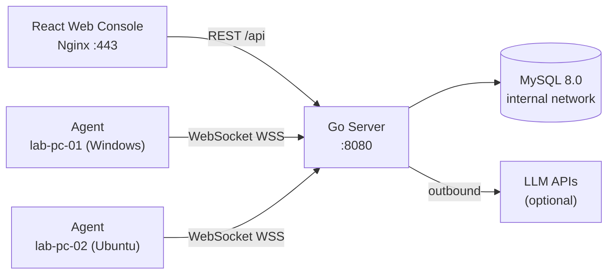

# LabOps

**轻量级开源运维平台 | Lightweight Open-Source Operations Platform**

[](https://github.com/cowhorse05/LabOps/actions/workflows/ci.yml)
[](https://go.dev/)
[](LICENSE)
[]()
[]()

---

[**English**](#overview) | [**中文文档**](README_CN.md)

**Live Demo:** [https://cowhorse.xyz](https://cowhorse.xyz) (password-protected)

---

## Overview

LabOps is a lightweight, open-source operations console built for students, classroom labs, homelab enthusiasts, and small IT teams. It provides a **real Agent-Server-Web control loop** — agents report inventory and heartbeat data, receive commands, return execution results, and leave a full audit trail — all deployable from a single `docker compose up` command.

> LabOps is not trying to replace mature RMM or monitoring platforms. It is a readable, runnable full-stack project that demonstrates a real operations control loop with minimal dependencies. No mock data — every device in the dashboard is connected via a real WebSocket.

---

## Features

### Core Loop
- **Real Agent/Server/Web loop** — agents register, heartbeat (every 10s), execute commands, and report results; zero mock data
- **WebSocket real-time communication** — persistent bidirectional channel between server and every agent
- **Full audit trail** — every registration, connection, command dispatch, and result is recorded and searchable

### Device Management
- **Device inventory** — searchable device list with OS, IP, hostname, CPU/memory/disk specs
- **Live metrics** — real-time CPU %, memory %, disk % with auto-refreshing progress bars
- **Heartbeat tracking** — automatic online/offline detection (35s timeout, configurable)
- **Group management** — organize devices into logical groups with online rate statistics

### Task System
- **Command execution** — run commands on any device, capture stdout/stderr/exit code/duration
- **Batch dispatch** — send commands to every online device in a group with one click
- **Command templates** — predefined, parameterized commands with argument validation (enum, regex, range)
- **Task lifecycle** — pending → running → success/failed/timeout with full timing data

### AI Ops
- **Health scoring** — rule-based 0-100 score per device (CPU/memory/disk thresholds, offline detection)
- **LLM-powered analysis** — optional AI analysis via OpenAI-compatible or Anthropic APIs
- **Auto-remediation** — automatically execute safe (read-only) recommendations from the LLM
- **Manual recommendations** — review and execute AI-suggested commands with one click

### Security
- **Session cookie authentication** — HttpOnly, Secure, SameSite=Strict cookies with CSRF protection
- **Per-device credentials** — one-time enrollment codes exchanged for unique 256-bit device secrets
- **RBAC** — three roles (admin, operator, viewer) with granular permissions
- **bcrypt passwords** — cost factor 12, minimum 12 characters, forced change on first login
- **Rate limiting** — per-IP token bucket (60/s general, 5/3min login, 10/min enrollment)
- **AES-256-GCM encryption** — LLM API keys encrypted at rest

### Deployment
- **Single-command deploy** — `docker compose up -d`
- **Auto TLS** — built-in Let's Encrypt integration via Nginx
- **Dual database** — SQLite (zero-config) or MySQL 8.0+ (production)
- **Systemd integration** — hardened service units for agents with security restrictions
- **Automated backups** — daily MySQL dumps with 7-day daily + 4-week retention

---

## Quick Start

### Prerequisites

| Platform | Requirements |
|----------|-------------|
| **Windows** | PowerShell 5+, Docker Desktop or Podman |
| **Linux** | bash, Docker Engine 24+ or Podman |
| **Both** | Node.js 20+ (for local dev), Go 1.24+ (optional — builds run inside Docker) |

### 3-Step Getting Started

**Windows (PowerShell):**

```powershell
git clone https://github.com/cowhorse05/LabOps.git
cd LabOps
.\scripts\dev.ps1
# Open http://localhost:5173
```

**Linux / macOS (bash):**

```bash
git clone https://github.com/cowhorse05/LabOps.git
cd LabOps
bash scripts/dev.sh
# Open http://localhost:5173
```

The first build takes 2-3 minutes. The dev compose launches the server, web console, and **4 simulated agents** with mock metrics (Ubuntu, Windows, Server, Edge profiles).

### Stop the Stack

```powershell
# Windows
.\scripts\compose-down.ps1

# Linux
bash scripts/compose-down.sh
```

### First Administrator

LabOps has **no default password**. Local development bootstraps `admin` with the password configured in `compose.dev.yaml` and forces an immediate password change. Production requires `LABOPS_BOOTSTRAP_ADMIN_PASSWORD` in the untracked `.env` file.

### Run Tests

```powershell
.\scripts\test.ps1   # TypeScript typecheck + Go vet/test + compose validation
```

---

## Live Demo

A production instance is running at **[https://cowhorse.xyz](https://cowhorse.xyz)** with real agents connected.

> This is a password-protected demo. It demonstrates the full Agent-Server-Web loop on a live Ubuntu server with Docker Compose, MySQL, Let's Encrypt TLS, and systemd-managed agents.

---

## Architecture



### Data Flow

```text
 Agent ──WebSocket──▶  Server  ◀──REST API──▶  Web Console
   │                      │                        │
   │  register            │  UpsertDevice          │  GET /api/devices
   │  heartbeat (10s)     │  UpdateHeartbeat       │  POST /api/tasks
   │  task_result         │  CompleteTask          │  GET /api/aiops/report
                          │  CreateAudit
                          ▼
                   SQLite / MySQL
```

### WebSocket Protocol

All messages use the JSON envelope format: `{"type": "<type>", "payload": {...}}`.

| Direction | Type | Payload | Frequency |
|-----------|------|---------|-----------|
| Agent → Server | `register` | Device profile (hostname, OS, CPU, memory, disk) | On connect |
| Agent → Server | `heartbeat` | Live metrics (CPU%, memory%, disk%) | Every 10s |
| Agent → Server | `task_result` | stdout, stderr, exit code, duration (ms) | On completion |
| Server → Agent | `registered` | Confirmation | After register |
| Server → Agent | `command` | Task ID, command string/executable, timeout | On dispatch |
| Server → Agent | `error` | Error message | On failure |

---

## Tech Stack

| Layer | Technology | Version |
|-------|-----------|---------|
| **Frontend** | React + TypeScript + Vite | 18 / 5.6 / 5.4 |
| **UI Library** | Ant Design (zhCN locale) | 5.21 |
| **State** | Zustand | 4.5 |
| **HTTP Client** | Axios | 1.7 |
| **Routing** | react-router-dom | 6.27 |
| **Backend** | Go stdlib `net/http` (Go 1.22+ patterns) | 1.25 |
| **WebSocket** | gorilla/websocket | v1.5.3 |
| **Auth** | Session cookies + bcrypt (+ CSRF) | — |
| **Database** | SQLite (modernc.org/sqlite) / MySQL 8.0 | — |
| **Agent** | Go + gorilla/websocket + gopsutil v4 | 1.24 |
| **Reverse Proxy** | Nginx (TLS termination + static serving) | 1.27 |
| **Container** | Docker Compose (3 services) | — |

---

## API Reference

Base URL: `https://<host>/api`

### Authentication

| Method | Path | Auth | Description |
|--------|------|:----:|-------------|
| `POST` | `/auth/login` | — | Login, sets session cookies |
| `POST` | `/auth/logout` | Session | Logout, clears session |
| `POST` | `/auth/change-password` | Session | Change own password |
| `GET` | `/auth/me` | Session | Current authenticated user |

### Device Management

| Method | Path | Auth | Permission | Description |
|--------|------|:----:|:----------:|-------------|
| `GET` | `/stats` | Session | `system:read` | Device statistics (total/online/offline) |
| `GET` | `/devices` | Session | `system:read` | List all devices |
| `GET` | `/devices/{id}` | Session | `system:read` | Device detail + live metrics |
| `GET` | `/devices/{id}/tasks` | Session | `system:read` | Tasks for a device |
| `POST` | `/devices` | Session | `system:device-revoke` | Create device manually |
| `DELETE` | `/devices/{id}` | Session | `system:device-revoke` | Delete device |
| `POST` | `/devices/{id}/revoke` | Session | `system:device-revoke` | Revoke device credential |
| `GET` | `/groups` | Session | `system:read` | Groups with online counts |

### Enrollment

| Method | Path | Auth | Permission | Description |
|--------|------|:----:|:----------:|-------------|
| `GET` | `/enrollment-codes` | Session | `system:enrollment` | List enrollment codes |
| `POST` | `/enrollment-codes` | Session | `system:enrollment` | Create enrollment code |
| `DELETE` | `/enrollment-codes/{id}` | Session | `system:enrollment` | Revoke enrollment code |
| `POST` | `/agent/enroll` | — | — | Agent enrollment (one-time code) |

### Tasks

| Method | Path | Auth | Permission | Description |
|--------|------|:----:|:----------:|-------------|
| `GET` | `/tasks` | Session | `system:read` | List tasks (limit 200) |
| `POST` | `/tasks` | Session | Varies¹ | Create/dispatch task |
| `GET` | `/tasks/{id}` | Session | `system:read` | Task detail + result |

¹ Ad-hoc commands require `commands:adhoc`; template execution requires `templates:execute`.

### Command Templates

| Method | Path | Auth | Permission | Description |
|--------|------|:----:|:----------:|-------------|
| `GET` | `/command-templates` | Session | `system:read` | List templates |
| `POST` | `/command-templates` | Session | `templates:manage` | Create template |
| `PUT` | `/command-templates/{id}` | Session | `templates:manage` | Update template |

### AI Ops

| Method | Path | Auth | Permission | Description |
|--------|------|:----:|:----------:|-------------|
| `GET` | `/aiops/report` | Session | `system:read` | Health analysis report |
| `GET` | `/aiops/llm-config` | Session | `aiops:llm` | Get LLM configuration |
| `PUT` | `/aiops/llm-config` | Session | `aiops:llm` | Save LLM configuration |
| `POST` | `/aiops/llm-test` | Session | `aiops:llm` | Test LLM connectivity |
| `POST` | `/aiops/recommendations/execute` | Session | `aiops:llm` | Execute LLM recommendation |
| `GET` | `/aiops/auto-mode` | Session | `aiops:llm` | Get auto-execute mode |
| `PUT` | `/aiops/auto-mode` | Session | `aiops:llm` | Set auto-execute mode |

### User Management

| Method | Path | Auth | Permission | Description |
|--------|------|:----:|:----------:|-------------|
| `GET` | `/users` | Session | `system:users` | List users |
| `POST` | `/users` | Session | `system:users` | Create user |
| `PUT` | `/users/{id}` | Session | `system:users` | Update user role/status |

### System

| Method | Path | Auth | Description |
|--------|------|:----:|-------------|
| `GET` | `/health` | — | Health check |
| `GET` | `/audit-logs` | Session | Audit log entries (limit 200) |
| `GET` | `/agent/ws` | Agent | WebSocket upgrade for agents |

---

## Environment Variables

### Server

| Variable | Default | Description |
|----------|---------|-------------|
| `LABOPS_ADDR` | `:8080` | Server listen address |
| `LABOPS_DB_DRIVER` | `mysql` | Database driver: `sqlite` or `mysql` |
| `LABOPS_DB_PATH` | `data/labops.db` | SQLite database file path |
| `LABOPS_MYSQL_DSN` | — | MySQL Data Source Name |
| `LABOPS_ENV` | `development` | Environment: `development` or `production` |
| `LABOPS_PUBLIC_ORIGIN` | `http://localhost:5173` | Exact origin for CORS and session binding |
| `LABOPS_BOOTSTRAP_ADMIN_PASSWORD` | — | Initial admin password (empty DB only) |
| `LABOPS_ENCRYPTION_KEY` | — | Base64 32-byte key for AES-256-GCM secret encryption |
| `LABOPS_HEARTBEAT_TIMEOUT` | `35s` | Mark device offline after this duration |
| `LABOPS_TASK_TIMEOUT` | `5m` | Task execution timeout |
| `LABOPS_LLM_URL` | — | LLM API base URL |
| `LABOPS_LLM_API_KEY` | — | LLM API key |

### Agent

| Variable | Default | Description |
|----------|---------|-------------|
| `LABOPS_SERVER_URL` | `http://localhost:8080` | Server URL |
| `LABOPS_AGENT_TOKEN` | — | Legacy shared token (deprecated) |
| `LABOPS_DEVICE_SECRET` | — | Per-device secret (from enrollment) |
| `LABOPS_ENROLLMENT_CODE` | — | One-time enrollment code |
| `LABOPS_AGENT_CREDENTIALS` | Platform-specific | Credentials file path |
| `LABOPS_AGENT_NAME` | OS hostname | Device display name |
| `LABOPS_AGENT_GROUP` | `default` | Device group |
| `LABOPS_AGENT_ID` | `agent-<name>` | Stable agent ID |
| `LABOPS_MOCK_PROFILE` | `ubuntu` | Mock profile: ubuntu, windows-lab, server, edge-node |
| `LABOPS_AGENT_REAL` | `false` | Use real system metrics |

### Docker Compose

| Variable | Required | Description |
|----------|:--------:|-------------|
| `SERVER_HOST` | Yes | Public IP or domain |
| `LABOPS_VERSION` | No | Image tag (default: `dev`) |
| `MYSQL_ROOT_PASSWORD` | Yes | MySQL root password |
| `MYSQL_PASSWORD` | Yes | MySQL application password |

---

## Project Structure

```text
LabOps/
├── web/                            # React frontend (12 pages)
│   ├── src/
│   │   ├── api/                    # Axios client + typed API functions
│   │   ├── components/             # ErrorBoundary, ChangePasswordModal
│   │   ├── hooks/                  # useLoadable, useLoadableAll
│   │   ├── layouts/                # AppLayout (sidebar + header + content)
│   │   ├── pages/                  # 12 page components
│   │   │   ├── LoginPage           #   Authentication + forced password change
│   │   │   ├── DashboardPage       #   Stats, device overview, recent activity
│   │   │   ├── DevicesPage         #   Searchable device list + management
│   │   │   ├── DeviceDetailPage    #   Live metrics + ad-hoc command execution
│   │   │   ├── GroupsPage          #   Group statistics
│   │   │   ├── TasksPage           #   Batch commands + task history
│   │   │   ├── AuditPage           #   Audit log browser
│   │   │   ├── AiOpsPage           #   AI health analysis + recommendations
│   │   │   ├── AiOpsSettingsPage   #   LLM provider configuration
│   │   │   ├── EnrollmentPage      #   Enrollment code management
│   │   │   ├── TemplatesPage       #   Command template CRUD
│   │   │   └── UsersPage           #   User management
│   │   ├── stores/                 # Zustand auth store
│   │   ├── styles/                 # Global CSS
│   │   ├── utils/                  # Status helpers, permission utilities
│   │   └── types.ts                # TypeScript type definitions
│   ├── nginx/                      # Nginx config template (TLS, proxy, SPA)
│   ├── Dockerfile                  # Production build (Node build → Nginx serve)
│   └── Dockerfile.dev              # Development build (Vite dev server)
├── server/                         # Go backend
│   ├── cmd/server/main.go          # Entry point + env parsing + graceful shutdown
│   ├── internal/core/
│   │   ├── app.go                  # HTTP routes, middleware chain, maintenance loop
│   │   ├── api.go                  # REST handlers (34 endpoints)
│   │   ├── agent.go                # WebSocket hub, agent lifecycle, task dispatch
│   │   ├── store.go                # Database CRUD (SQLite + MySQL dual dialect)
│   │   ├── types.go                # Domain types, constants, wire protocol
│   │   ├── analyzer.go             # AI Ops rule engine + health scoring
│   │   ├── llm.go                  # OpenAI/Anthropic LLM client
│   │   ├── auth_context.go         # Session auth, CSRF, permission middleware
│   │   ├── enrollment.go           # Device enrollment + credential management
│   │   ├── encryption.go           # AES-256-GCM encryption utilities
│   │   ├── templates.go            # Command template rendering + validation
│   │   ├── security_store.go       # User/session/permission persistence
│   │   ├── dialect.go              # Database dialect interface + schema definition
│   │   ├── dialect_mysql.go        # MySQL dialect implementation
│   │   ├── dialect_sqlite.go       # SQLite dialect implementation
│   │   ├── migrations.go           # Versioned schema migrations
│   │   ├── *_test.go               # 50+ test functions (72.3% core coverage)
│   │   └── concurrent_test.go      # Race condition / concurrency tests
│   └── Dockerfile                  # Multi-stage build (Go → Alpine, non-root)
├── agent/                          # Go agent
│   ├── cmd/agent/
│   │   ├── main.go                 # Agent logic (connect, enroll, heartbeat, execute)
│   │   └── main_test.go            # Agent tests (7 functions)
│   └── Dockerfile                  # Multi-stage build (Go → Alpine, non-root)
├── deploy/                         # Deployment resources
│   ├── README.md                   # Production deployment guide (Ubuntu)
│   ├── systemd/
│   │   ├── labops-agent.service    # Hardened agent systemd unit
│   │   ├── labops-backup.service   # Database backup oneshot unit
│   │   └── labops-backup.timer     # Daily backup timer (03:15 UTC)
│   └── acme-webroot/               # Certbot ACME challenge webroot
├── scripts/                        # Utility scripts
│   ├── dev.sh / dev.ps1            # Development compose launch
│   ├── compose-down.sh / .ps1      # Development compose teardown
│   ├── deploy.sh / deploy.ps1      # Production deployment (native/compose)
│   ├── install-agent.sh            # Linux agent installer
│   ├── uninstall-agent.sh          # Linux agent uninstaller
│   ├── backup.sh / restore.sh      # Database backup & restore
│   ├── test.ps1                    # CI-like verification script
│   └── screenshots.py              # Playwright screenshot capture
├── docs/                           # Documentation
│   ├── architecture.md             # System architecture & internal logic
│   ├── deployment-guide.md         # Step-by-step deployment tutorial
│   ├── source-code-guide.md        # Source code reading guide (textbook-style)
│   ├── master-plan.md              # Project plan SSOT
│   ├── user-manual.md              # End-user guide (Chinese)
│   ├── product-plan.md             # Product positioning + MVP scope
│   ├── research.md                 # Competitive analysis
│   ├── roadmap.md                  # Version roadmap (v0.1 → v0.4)
│   ├── security.md                 # Security model overview
│   ├── secure-api.md               # API permission matrix
│   ├── dev-log.md                  # Phase-by-phase development log
│   ├── log.md                      # Detailed changelog
│   ├── report.md                   # Project summary report
│   └── features/
│       └── file-distribution/      # v0.3 file distribution design spec
├── data/                           # Test data & artifacts
│   ├── browser-smoke/              # Playwright E2E screenshots
│   └── browser-smoke.cjs           # Playwright smoke test script
├── .github/workflows/ci.yml        # GitHub Actions CI pipeline
├── compose.yaml                    # Production Docker Compose
├── compose.dev.yaml                # Development Docker Compose
├── .env.example                    # Environment variable template
├── CHANGELOG.md                    # Release changelog
├── CONTRIBUTING.md                 # Contribution guidelines
├── SECURITY.md                     # Security policy + disclosure
├── LICENSE                         # MIT License
├── README.md                       # This file
└── README_CN.md                    # Chinese README
```

---

## Documentation

| Document | Description |
|----------|-------------|
| **📁 Project** | |
| [Overview](docs/project/overview.md) | What LabOps is, problems it solves, use cases |
| [Architecture](docs/project/architecture.md) | System design, DB schema, auth, task lifecycle, AI Ops |
| [Highlights](docs/project/project-highlights.md) | Technical highlights with code paths and interview talking points |
| **📁 Deployment** | |
| [Overview](docs/deployment/overview.md) | Deployment mode comparison and selection guide |
| [Server Deployment](docs/deployment/server-deployment.md) | ★ Complete tutorial: from zero to live (newbie-friendly) |
| [Docker Compose](docs/deployment/docker-compose.md) | Docker Compose deployment (dev + production) |
| [Native Linux](docs/deployment/native-linux.md) | Bare-metal Linux deployment with systemd |
| [Nginx & HTTPS](docs/deployment/nginx-and-https.md) | Reverse proxy, TLS, certbot configuration |
| [Agent Deployment](docs/deployment/agent-deployment.md) | Agent installation, enrollment, systemd hardening |
| **📁 User Guide** | |
| [Quick Start](docs/user-guide/quick-start.md) | Login, first device, first command |
| [Devices](docs/user-guide/device-management.md) | Device list, live metrics, groups |
| [Tasks](docs/user-guide/task-management.md) | Commands, templates, batch dispatch, audit |
| [AI Ops](docs/user-guide/aiops-usage.md) | Health reports, LLM config, recommendations |
| **📁 Operations** | |
| [Data Storage](docs/operations/data-storage.md) | Where every piece of data lives, persistence guarantees |
| [Backup & Restore](docs/operations/backup-restore.md) | mysqldump, systemd timer, recovery procedures |
| [Migration](docs/operations/migration.md) | Moving to a new server step-by-step |
| [Upgrade & Rollback](docs/operations/upgrade-rollback.md) | Version upgrades, rollback strategies |
| **📁 Troubleshooting** | |
| [SSH](docs/troubleshooting/ssh.md) | Connection, keys, permissions |
| [Nginx](docs/troubleshooting/nginx.md) | 502, config errors, port conflicts |
| [Docker](docs/troubleshooting/docker.md) | Container startup, ports, env vars |
| [DNS & HTTPS](docs/troubleshooting/dns-and-https.md) | DNS resolution, certificates, ICP filing |
| [Agent](docs/troubleshooting/agent.md) | Connection, offline, systemd, credentials |
| **📁 Career** | |
| [Resume Project](docs/career/resume-project.md) | Resume descriptions for 3 roles, self-intro scripts |
| [Interview Q&A](docs/career/interview-questions.md) | 40 interview questions with reference answers |
| [STAR Stories](docs/career/star-stories.md) | 8 real project experience stories |
| **Other** | |
| [Source Code Guide](docs/source-code-guide.md) | Textbook-style code reading guide (15 chapters) |
| [User Manual](docs/user-manual.md) | Comprehensive end-user manual (Chinese) |
| [Master Plan](docs/master-plan.md) | Project plan SSOT, architecture decisions |
| [Roadmap](docs/roadmap.md) | Version roadmap (v0.1 → v0.4) |
| [Security](docs/security.md) | Security model overview |
| [Research](docs/research.md) | Competitive analysis |
| [File Distribution](docs/features/file-distribution/design.md) | v0.3 design spec |

---

## Production Deployment

### Docker Compose (Recommended)

```bash
git clone https://github.com/cowhorse05/LabOps.git
cd LabOps
cp .env.example .env
# Edit .env — replace every CHANGE_ME value
# See docs/deployment/server-deployment.md for detailed instructions

docker compose config --quiet   # Validate
docker compose build            # Build images
docker compose up -d            # Start services
```

### Native Linux (systemd)

```bash
sudo bash scripts/deploy.sh --mode native --install-deps
sudo systemctl start labops-server
```

### Native Windows

```powershell
.\scripts\deploy.ps1 -Mode native -InstallDeps
```

For complete production deployment instructions including TLS setup, agent installation, backup configuration, and troubleshooting, see the **[Server Deployment Guide](docs/deployment/server-deployment.md)**.

---

## Database Configuration

### SQLite (Zero Configuration)

No setup required. Set `LABOPS_DB_DRIVER=sqlite` and the database file is created at `LABOPS_DB_PATH` (default: `data/labops.db`). Ideal for development and small deployments.

### MySQL 8.0+ (Production)

Set these environment variables:

```env
LABOPS_DB_DRIVER=mysql
LABOPS_MYSQL_DSN=user:password@tcp(host:3306)/labops?parseTime=true&charset=utf8mb4
```

The target database is created automatically on first startup.

---

## Development

### Local Development

```bash
# Start the full dev stack (MySQL, server, Vite dev server)
bash scripts/dev.sh     # or .\scripts\dev.ps1 on Windows

# Run all checks
.\scripts\test.ps1      # TypeScript typecheck + tests + Go vet + Go test + compose validation
```

### Project Conventions

- **Windows-first development** — PowerShell scripts for all tooling
- **Go stdlib only** — no external web framework (no gin, echo, or chi)
- **Database-agnostic** — dialect abstraction supports SQLite and MySQL
- **No mock data in production** — the dev environment uses simulated agents with configurable profiles

---

## Contributing

Contributions are welcome. Please open an issue to discuss proposed changes before submitting a pull request.

Areas where contributions would be especially valuable:

- Additional agent mock profiles
- C++ agent implementation (planned for v0.4)
- File distribution feature implementation (design spec ready in `docs/features/file-distribution/`)
- Dashboard data visualization improvements
- Test coverage expansion

See [CONTRIBUTING.md](CONTRIBUTING.md) for guidelines.

---

## Security

For vulnerability disclosure, see [SECURITY.md](SECURITY.md). The project uses:

- bcrypt password hashing (cost 12) with minimum 12-character passwords
- Session cookie authentication with CSRF double-submit protection
- Per-device credentials via one-time enrollment codes
- AES-256-GCM encryption for stored secrets
- Rate limiting on authentication endpoints
- Containerized deployment with internal networking

---

## License

LabOps is licensed under the [MIT License](LICENSE).

---

## Acknowledgments

LabOps draws inspiration from several excellent open-source operations and monitoring platforms:

- [MeshCentral](https://github.com/Ylianst/MeshCentral) — agent architecture and remote management patterns
- [Tactical RMM](https://github.com/amidaware/tacticalrmm) — task execution and audit trail design
- [Fleet](https://github.com/fleetdm/fleet) — device inventory and grouping models
- [Zabbix](https://github.com/zabbix/zabbix) and [Netdata](https://github.com/netdata/netdata) — monitoring and health scoring concepts
