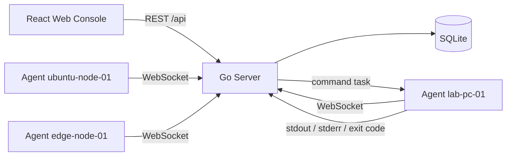

# LabOps

LabOps is a lightweight open-source operations console for students, labs, clubs, and homelab devices. It keeps the first version intentionally small but real: agents connect to a Go control plane, report inventory and heartbeat data, receive commands, return results, and leave an audit trail.

The project uses a Windows-first development workflow with Docker Desktop:

- `web/`: React + TypeScript + Vite + Ant Design + Zustand
- `server/`: Go API server, WebSocket agent channel, SQLite
- `agent/`: Go agent that can run locally or as multiple Docker containers
- `deploy/`: local demo environment
- `docs/`: research, product plan, logs, and report material

## Quick Start

Prerequisites:

- Windows + PowerShell
- Docker Desktop
- Node.js 20+ for local web development
- Go is optional locally; Go builds and tests can run in Docker

Run the full demo:

```powershell
.\scripts\dev.ps1
```

Open the console:

```text
http://localhost:5173
```

Demo login:

```text
admin / admin
```

The compose environment starts the server, web console, and multiple simulated agents. Stop it with:

```powershell
.\scripts\compose-down.ps1
```

## Architecture



## MVP Features

- Device registration and online/offline status
- Agent heartbeat and inventory reporting
- Single-device command execution
- Group command execution
- Task result tracking
- Audit log
- Docker-based multi-device demo

## Useful Commands

```powershell
# Full demo
.\scripts\dev.ps1

# Run verification checks
.\scripts\test.ps1

# Stop containers and remove demo network
.\scripts\compose-down.ps1
```

## Project Goal

LabOps is not trying to replace mature RMM, monitoring, or remote desktop platforms. Its goal is to be a readable, runnable full-stack project that demonstrates a real operations control loop on one PC.
