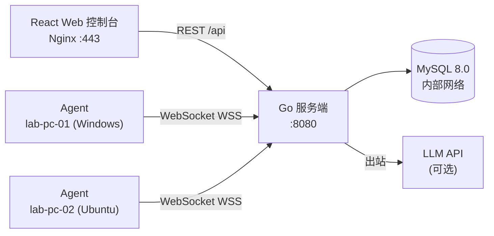

# LabOps

**轻量级开源运维平台 | Lightweight Open-Source Operations Platform**

[](https://github.com/cowhorse05/LabOps/actions/workflows/ci.yml)
[](https://go.dev/)
[](LICENSE)
[]()
[]()

---

[**English**](README.md) | [**中文文档**](#项目概述)

**在线演示：** [https://cowhorse.xyz](https://cowhorse.xyz)（需密码访问）

---

## 项目概述

LabOps 是一个轻量级开源运维平台，面向课堂实验室、家庭实验室爱好者和中小型 IT 团队。它提供了完整的 **Agent → 服务端 → Web 控制台** 运维闭环 —— Agent 实时上报设备信息和心跳数据，接收命令并返回执行结果，所有操作均记录完整的审计日志。一条 `docker compose up -d` 命令即可完成部署。

> LabOps 不是要替代成熟的 RMM 或监控平台。它是一个可读、可运行的全栈项目，以最小依赖演示真实的运维控制循环。无模拟数据 —— 仪表盘中的每一台设备都通过真实的 WebSocket 连接。

---

## 核心功能

### 运维闭环
- **真实 Agent/服务端/Web 循环** — Agent 注册、心跳上报（每 10 秒）、执行命令、返回结果，全程真实数据
- **WebSocket 实时通信** — 服务端与每个 Agent 之间保持持久双向通道
- **完整审计日志** — 每次注册、连接、命令下发和结果均被记录并可追溯

### 设备管理
- **设备清单** — 可搜索的设备列表，展示 OS、IP、主机名、CPU/内存/磁盘规格
- **实时指标** — CPU 使用率、内存使用率、磁盘使用率，自动刷新进度条
- **心跳追踪** — 自动在线/离线检测（35 秒超时，可配置）
- **分组管理** — 将设备组织到逻辑分组，显示在线率统计

### 任务系统
- **命令执行** — 在任意设备上运行命令，捕获 stdout、stderr、退出码、执行耗时
- **批量下发** — 一键向组内所有在线设备发送命令
- **命令模板** — 预定义参数化命令，支持枚举、正则、范围参数校验
- **任务生命周期** — 待执行 → 执行中 → 成功/失败/超时，含完整计时数据

### AI 运维
- **健康评分** — 基于规则的 0-100 设备健康分（CPU/内存/磁盘阈值、离线检测）
- **LLM 智能分析** — 可选接入 OpenAI 兼容或 Anthropic API 进行 AI 分析
- **自动修复** — 自动执行 LLM 建议的安全（只读）命令
- **人工审批** — 审查并一键执行 AI 推荐的运维命令

### 安全机制
- **会话 Cookie 认证** — HttpOnly、Secure、SameSite=Strict Cookie + CSRF 保护
- **每设备独立凭据** — 一次性接入码兑换唯一的 256 位设备密钥
- **RBAC 权限模型** — 三级角色（管理员/操作员/观察者），细粒度权限控制
- **bcrypt 密码哈希** — 成本因子 12，最少 12 字符，首次登录强制改密
- **速率限制** — 按 IP 的令牌桶（通用 60 次/秒、登录 5 次/3 分钟、接入 10 次/分钟）
- **AES-256-GCM 加密** — LLM API Key 静态加密存储

### 部署运维
- **一条命令部署** — `docker compose up -d`
- **自动 TLS** — 内置 Nginx + Let's Encrypt 集成
- **双数据库支持** — SQLite（零配置）或 MySQL 8.0+（生产环境）
- **Systemd 集成** — 带安全加固的 Agent 服务单元
- **自动备份** — 每日 MySQL 转储，保留 7 天日备份 + 4 周周备份

---

## 快速开始

### 环境要求

| 平台 | 要求 |
|------|------|
| **Windows** | PowerShell 5+，Docker Desktop 或 Podman |
| **Linux** | bash，Docker Engine 24+ 或 Podman |
| **通用** | Node.js 20+（本地开发），Go 1.24+（可选，构建在 Docker 内完成） |

### 三步启动

**Windows (PowerShell)：**

```powershell
git clone https://github.com/cowhorse05/LabOps.git
cd LabOps
.\scripts\dev.ps1
# 浏览器打开 http://localhost:5173
```

**Linux / macOS (bash)：**

```bash
git clone https://github.com/cowhorse05/LabOps.git
cd LabOps
bash scripts/dev.sh
# 浏览器打开 http://localhost:5173
```

首次构建需要 2-3 分钟。开发环境会启动服务端、Web 控制台和 **4 个模拟 Agent**，分别使用 Ubuntu、Windows、Server、Edge 四种配置文件的模拟指标。

### 停止服务

```powershell
# Windows
.\scripts\compose-down.ps1

# Linux
bash scripts/compose-down.sh
```

### 首次管理员

LabOps **不提供通用默认密码**。本地开发环境由 `compose.dev.yaml` 配置管理员密码并强制在首次登录时修改。生产环境必须通过未提交的 `.env` 文件提供 `LABOPS_BOOTSTRAP_ADMIN_PASSWORD`。

### 运行测试

```powershell
.\scripts\test.ps1   # TypeScript 类型检查 + Go vet/test + compose 配置校验
```

---

## 在线演示

生产实例运行在 **[https://cowhorse.xyz](https://cowhorse.xyz)**，已接入真实 Agent。

> 演示站点需要密码访问。它展示了在真实 Ubuntu 服务器上使用 Docker Compose、MySQL、Let's Encrypt TLS 和 systemd 管理 Agent 的完整运维闭环。

---

## 系统架构



### 数据流

```text
 Agent ──WebSocket──▶  服务端  ◀──REST API──▶  Web 控制台
   │                      │                        │
   │  register            │  UpsertDevice          │  GET /api/devices
   │  heartbeat (10s)     │  UpdateHeartbeat       │  POST /api/tasks
   │  task_result         │  CompleteTask          │  GET /api/aiops/report
                          │  CreateAudit
                          ▼
                   SQLite / MySQL
```

### WebSocket 协议

所有消息均使用 JSON 信封格式：`{"type": "<类型>", "payload": {...}}`。

| 方向 | 类型 | 载荷内容 | 频率 |
|------|------|----------|------|
| Agent → 服务端 | `register` | 设备信息（主机名、OS、CPU、内存、磁盘） | 连接时 |
| Agent → 服务端 | `heartbeat` | 实时指标（CPU%、内存%、磁盘%） | 每 10 秒 |
| Agent → 服务端 | `task_result` | stdout、stderr、退出码、耗时（毫秒） | 命令完成时 |
| 服务端 → Agent | `registered` | 注册确认 | 注册后 |
| 服务端 → Agent | `command` | 任务 ID、命令字符串/可执行文件、超时 | 任务下发时 |
| 服务端 → Agent | `error` | 错误信息 | 出错时 |

---

## 技术栈

| 层级 | 技术 | 版本 |
|------|------|------|
| **前端** | React + TypeScript + Vite | 18 / 5.6 / 5.4 |
| **UI 组件库** | Ant Design（zhCN 中文 locale） | 5.21 |
| **状态管理** | Zustand | 4.5 |
| **HTTP 客户端** | Axios | 1.7 |
| **路由** | react-router-dom | 6.27 |
| **后端** | Go 标准库 `net/http`（Go 1.22+ 路由模式） | 1.25 |
| **WebSocket** | gorilla/websocket | v1.5.3 |
| **认证** | Session Cookie + bcrypt（+ CSRF） | — |
| **数据库** | SQLite（modernc.org/sqlite）/ MySQL 8.0 | — |
| **Agent** | Go + gorilla/websocket + gopsutil v4 | 1.24 |
| **反向代理** | Nginx（TLS 终止 + 静态文件服务） | 1.27 |
| **容器** | Docker Compose（3 个服务） | — |

---

## API 参考

基础 URL：`https://<host>/api`

### 认证

| 方法 | 路径 | 认证 | 说明 |
|------|------|:----:|------|
| `POST` | `/auth/login` | — | 登录，设置会话 Cookie |
| `POST` | `/auth/logout` | Session | 登出，清除会话 |
| `POST` | `/auth/change-password` | Session | 修改自己的密码 |
| `GET` | `/auth/me` | Session | 当前登录用户信息 |

### 设备管理

| 方法 | 路径 | 认证 | 权限 | 说明 |
|------|------|:----:|:----:|------|
| `GET` | `/stats` | Session | `system:read` | 设备统计（总数/在线/离线） |
| `GET` | `/devices` | Session | `system:read` | 所有设备列表 |
| `GET` | `/devices/{id}` | Session | `system:read` | 设备详情 + 实时指标 |
| `GET` | `/devices/{id}/tasks` | Session | `system:read` | 设备的关联任务 |
| `POST` | `/devices` | Session | `system:device-revoke` | 手动创建设备 |
| `DELETE` | `/devices/{id}` | Session | `system:device-revoke` | 删除设备 |
| `POST` | `/devices/{id}/revoke` | Session | `system:device-revoke` | 吊销设备凭据 |
| `GET` | `/groups` | Session | `system:read` | 分组及其在线数 |

### 设备接入

| 方法 | 路径 | 认证 | 权限 | 说明 |
|------|------|:----:|:----:|------|
| `GET` | `/enrollment-codes` | Session | `system:enrollment` | 接入码列表 |
| `POST` | `/enrollment-codes` | Session | `system:enrollment` | 创建接入码 |
| `DELETE` | `/enrollment-codes/{id}` | Session | `system:enrollment` | 吊销接入码 |
| `POST` | `/agent/enroll` | — | — | Agent 接入（一次性接入码） |

### 任务

| 方法 | 路径 | 认证 | 权限 | 说明 |
|------|------|:----:|:----:|------|
| `GET` | `/tasks` | Session | `system:read` | 任务列表（最近 200 条） |
| `POST` | `/tasks` | Session | 视类型而定¹ | 创建/下发任务 |
| `GET` | `/tasks/{id}` | Session | `system:read` | 任务详情 + 执行结果 |

¹ 临时命令需要 `commands:adhoc` 权限；模板执行需要 `templates:execute` 权限。

### 命令模板

| 方法 | 路径 | 认证 | 权限 | 说明 |
|------|------|:----:|:----:|------|
| `GET` | `/command-templates` | Session | `system:read` | 模板列表 |
| `POST` | `/command-templates` | Session | `templates:manage` | 创建模板 |
| `PUT` | `/command-templates/{id}` | Session | `templates:manage` | 更新模板 |

### AI 运维

| 方法 | 路径 | 认证 | 权限 | 说明 |
|------|------|:----:|:----:|------|
| `GET` | `/aiops/report` | Session | `system:read` | 健康分析报告 |
| `GET` | `/aiops/llm-config` | Session | `aiops:llm` | 查看 LLM 配置 |
| `PUT` | `/aiops/llm-config` | Session | `aiops:llm` | 保存 LLM 配置 |
| `POST` | `/aiops/llm-test` | Session | `aiops:llm` | 测试 LLM 连接 |
| `POST` | `/aiops/recommendations/execute` | Session | `aiops:llm` | 执行 LLM 推荐命令 |
| `GET` | `/aiops/auto-mode` | Session | `aiops:llm` | 获取自动执行模式 |
| `PUT` | `/aiops/auto-mode` | Session | `aiops:llm` | 设置自动执行模式 |

### 用户管理

| 方法 | 路径 | 认证 | 权限 | 说明 |
|------|------|:----:|:----:|------|
| `GET` | `/users` | Session | `system:users` | 用户列表 |
| `POST` | `/users` | Session | `system:users` | 创建用户 |
| `PUT` | `/users/{id}` | Session | `system:users` | 更新用户角色/状态 |

### 系统

| 方法 | 路径 | 认证 | 说明 |
|------|------|:----:|------|
| `GET` | `/health` | — | 健康检查 |
| `GET` | `/audit-logs` | Session | 审计日志（最近 200 条） |
| `GET` | `/agent/ws` | Agent | Agent WebSocket 升级 |

---

## 环境变量

### 服务端

| 变量 | 默认值 | 说明 |
|------|--------|------|
| `LABOPS_ADDR` | `:8080` | 服务端监听地址 |
| `LABOPS_DB_DRIVER` | `mysql` | 数据库驱动：`sqlite` 或 `mysql` |
| `LABOPS_DB_PATH` | `data/labops.db` | SQLite 数据库文件路径 |
| `LABOPS_MYSQL_DSN` | — | MySQL 数据源名称 |
| `LABOPS_ENV` | `development` | 运行环境：`development` 或 `production` |
| `LABOPS_PUBLIC_ORIGIN` | `http://localhost:5173` | CORS 和会话绑定的精确 Origin |
| `LABOPS_BOOTSTRAP_ADMIN_PASSWORD` | — | 初始化管理员密码（仅空数据库时使用） |
| `LABOPS_ENCRYPTION_KEY` | — | Base64 编码的 32 字节密钥，用于 AES-256-GCM 加密 |
| `LABOPS_HEARTBEAT_TIMEOUT` | `35s` | 心跳超时后标记为离线 |
| `LABOPS_TASK_TIMEOUT` | `5m` | 任务执行超时时间 |
| `LABOPS_LLM_URL` | — | LLM API 基础 URL |
| `LABOPS_LLM_API_KEY` | — | LLM API 密钥 |

### Agent

| 变量 | 默认值 | 说明 |
|------|--------|------|
| `LABOPS_SERVER_URL` | `http://localhost:8080` | 服务端 URL |
| `LABOPS_AGENT_TOKEN` | — | 旧版共享令牌（已废弃） |
| `LABOPS_DEVICE_SECRET` | — | 每设备独立密钥（来自接入流程） |
| `LABOPS_ENROLLMENT_CODE` | — | 一次性接入码 |
| `LABOPS_AGENT_CREDENTIALS` | 平台相关 | 凭据文件路径 |
| `LABOPS_AGENT_NAME` | 主机名 | 设备显示名称 |
| `LABOPS_AGENT_GROUP` | `default` | 设备分组 |
| `LABOPS_AGENT_ID` | `agent-<name>` | 稳定的 Agent ID |
| `LABOPS_MOCK_PROFILE` | `ubuntu` | 模拟配置文件：ubuntu、windows-lab、server、edge-node |
| `LABOPS_AGENT_REAL` | `false` | 使用真实系统指标 |

### Docker Compose

| 变量 | 必填 | 说明 |
|------|:--:|------|
| `SERVER_HOST` | 是 | 公网 IP 或域名 |
| `LABOPS_VERSION` | 否 | 镜像标签（默认：`dev`） |
| `MYSQL_ROOT_PASSWORD` | 是 | MySQL root 密码 |
| `MYSQL_PASSWORD` | 是 | MySQL 应用密码 |

---

## 项目结构

```text
LabOps/
├── web/                            # React 前端（12 个页面）
│   ├── src/
│   │   ├── api/                    # Axios 客户端 + 类型化 API 函数
│   │   ├── components/             # ErrorBoundary、ChangePasswordModal
│   │   ├── hooks/                  # useLoadable、useLoadableAll
│   │   ├── layouts/                # AppLayout（侧边栏 + 顶栏 + 内容区）
│   │   ├── pages/                  # 12 个页面组件
│   │   │   ├── LoginPage           #   登录 + 强制改密
│   │   │   ├── DashboardPage       #   仪表盘：统计、设备概览、最近活动
│   │   │   ├── DevicesPage         #   设备列表：搜索 + 管理
│   │   │   ├── DeviceDetailPage    #   设备详情：实时指标 + 临时命令
│   │   │   ├── GroupsPage          #   分组管理：在线率统计
│   │   │   ├── TasksPage           #   任务：批量命令 + 历史记录
│   │   │   ├── AuditPage           #   审计日志浏览
│   │   │   ├── AiOpsPage           #   AI 运维：健康分析 + 推荐
│   │   │   ├── AiOpsSettingsPage   #   AI 运维设置：LLM 配置
│   │   │   ├── EnrollmentPage      #   设备接入码管理
│   │   │   ├── TemplatesPage       #   命令模板增删改查
│   │   │   └── UsersPage           #   用户管理
│   │   ├── stores/                 # Zustand 认证状态
│   │   ├── styles/                 # 全局 CSS
│   │   ├── utils/                  # 状态工具函数、权限工具函数
│   │   └── types.ts                # TypeScript 类型定义
│   ├── nginx/                      # Nginx 配置模板（TLS、代理、SPA）
│   ├── Dockerfile                  # 生产构建（Node 构建 → Nginx 服务）
│   └── Dockerfile.dev              # 开发构建（Vite 开发服务器）
├── server/                         # Go 后端
│   ├── cmd/server/main.go          # 入口点：环境变量解析 + 优雅关闭
│   ├── internal/core/
│   │   ├── app.go                  # HTTP 路由、中间件链、维护循环
│   │   ├── api.go                  # REST 处理器（34 个端点）
│   │   ├── agent.go                # WebSocket Hub、Agent 生命周期、任务下发
│   │   ├── store.go                # 数据库 CRUD（SQLite + MySQL 双驱动）
│   │   ├── types.go                # 领域模型、常量、通信协议
│   │   ├── analyzer.go             # AI 运维规则引擎 + 健康评分
│   │   ├── llm.go                  # OpenAI / Anthropic LLM 客户端
│   │   ├── auth_context.go         # 会话认证、CSRF、权限中间件
│   │   ├── enrollment.go           # 设备接入 + 凭据管理
│   │   ├── encryption.go           # AES-256-GCM 加密工具
│   │   ├── templates.go            # 命令模板渲染 + 参数校验
│   │   ├── security_store.go       # 用户/会话/权限持久化
│   │   ├── dialect.go              # 数据库方言接口 + Schema 定义
│   │   ├── dialect_mysql.go        # MySQL 方言实现
│   │   ├── dialect_sqlite.go       # SQLite 方言实现
│   │   ├── migrations.go           # 版本化 Schema 迁移
│   │   ├── *_test.go               # 50+ 测试函数（72.3% 核心覆盖率）
│   │   └── concurrent_test.go      # 竞争条件 / 并发测试
│   └── Dockerfile                  # 多阶段构建（Go → Alpine，非 root 用户）
├── agent/                          # Go Agent
│   ├── cmd/agent/
│   │   ├── main.go                 # Agent 逻辑（连接、接入、心跳、命令执行）
│   │   └── main_test.go            # Agent 测试（7 个函数）
│   └── Dockerfile                  # 多阶段构建（Go → Alpine，非 root 用户）
├── deploy/                         # 部署资源
│   ├── README.md                   # 生产部署指南（Ubuntu）
│   ├── systemd/
│   │   ├── labops-agent.service    # 安全加固的 Agent systemd 单元
│   │   ├── labops-backup.service   # 数据库备份一次性单元
│   │   └── labops-backup.timer     # 每日备份定时器（03:15 UTC）
│   └── acme-webroot/               # Certbot ACME 验证 Webroot
├── scripts/                        # 工具脚本
│   ├── dev.sh / dev.ps1            # 开发 Compose 启动
│   ├── compose-down.sh / .ps1      # 开发 Compose 停止
│   ├── deploy.sh / deploy.ps1      # 生产部署（native/compose）
│   ├── install-agent.sh            # Linux Agent 安装
│   ├── uninstall-agent.sh          # Linux Agent 卸载
│   ├── backup.sh / restore.sh      # 数据库备份与恢复
│   ├── test.ps1                    # CI 风格验证脚本
│   └── screenshots.py              # Playwright 截图脚本
├── docs/                           # 文档
│   ├── architecture.md             # 系统架构与内部逻辑
│   ├── deployment-guide.md         # 一步步部署教程
│   ├── source-code-guide.md        # 源码阅读指南（教科书风格）
│   ├── master-plan.md              # 项目计划 SSOT
│   ├── user-manual.md              # 用户手册（中文）
│   ├── product-plan.md             # 产品定位 + MVP 范围
│   ├── research.md                 # 竞品分析
│   ├── roadmap.md                  # 版本路线图（v0.1 → v0.4）
│   ├── security.md                 # 安全模型概述
│   ├── secure-api.md               # API 权限矩阵
│   ├── dev-log.md                  # 分阶段开发日志
│   ├── log.md                      # 详细变更记录
│   ├── report.md                   # 项目总结报告
│   └── features/
│       └── file-distribution/      # v0.3 文件分发设计规范
├── data/                           # 测试数据与产物
│   ├── browser-smoke/              # Playwright E2E 截图
│   └── browser-smoke.cjs           # Playwright 冒烟测试脚本
├── .github/workflows/ci.yml        # GitHub Actions CI 流水线
├── compose.yaml                    # 生产环境 Docker Compose
├── compose.dev.yaml                # 开发环境 Docker Compose
├── .env.example                    # 环境变量模板
├── CHANGELOG.md                    # 版本更新日志
├── CONTRIBUTING.md                 # 贡献指南
├── SECURITY.md                     # 安全策略 + 漏洞报告
├── LICENSE                         # MIT 许可证
├── README.md                       # 英文 README
└── README_CN.md                    # 中文 README（本文件）
```

---

## 文档

| 文档 | 说明 |
|------|------|
| **📁 项目** | |
| [项目概述](docs/project/overview.md) | LabOps 是什么、解决什么问题、适用场景 |
| [系统架构](docs/project/architecture.md) | 系统设计、数据库 Schema、认证、任务生命周期、AI Ops |
| [技术亮点](docs/project/project-highlights.md) | 技术实现细节、代码路径、面试表述 |
| **📁 部署** | |
| [部署概览](docs/deployment/overview.md) | 部署方式对比与选择指南 |
| [服务器部署教程](docs/deployment/server-deployment.md) | ★ 完整教程：从零到上线（新手友好） |
| [Docker Compose](docs/deployment/docker-compose.md) | Docker Compose 部署（开发 + 生产） |
| [原生 Linux](docs/deployment/native-linux.md) | 原生 Linux systemd 部署 |
| [Nginx 与 HTTPS](docs/deployment/nginx-and-https.md) | 反向代理、TLS、证书配置 |
| [Agent 部署](docs/deployment/agent-deployment.md) | Agent 安装、接入、systemd 加固 |
| **📁 用户手册** | |
| [快速开始](docs/user-guide/quick-start.md) | 登录、首台设备、第一条命令 |
| [设备管理](docs/user-guide/device-management.md) | 设备列表、实时指标、分组 |
| [任务管理](docs/user-guide/task-management.md) | 命令执行、模板、批量下发、审计 |
| [AI Ops](docs/user-guide/aiops-usage.md) | 健康报告、LLM 配置、推荐命令 |
| **📁 运维** | |
| [数据持久化](docs/operations/data-storage.md) | 每条数据的存储位置、持久化保证 |
| [备份与恢复](docs/operations/backup-restore.md) | mysqldump、systemd timer、恢复流程 |
| [服务器迁移](docs/operations/migration.md) | 一步步迁移到新服务器 |
| [升级与回滚](docs/operations/upgrade-rollback.md) | 版本升级、回滚策略 |
| **📁 故障排查** | |
| [SSH](docs/troubleshooting/ssh.md) | 连接、密钥、权限问题 |
| [Nginx](docs/troubleshooting/nginx.md) | 502、配置错误、端口冲突 |
| [Docker](docs/troubleshooting/docker.md) | 容器启动、端口、环境变量 |
| [DNS 与 HTTPS](docs/troubleshooting/dns-and-https.md) | DNS 解析、证书、备案 |
| [Agent](docs/troubleshooting/agent.md) | 连接、离线、systemd、凭据 |
| **📁 求职面试** | |
| [简历项目](docs/career/resume-project.md) | 三个岗位的简历描述、自我介绍 |
| [面试问答](docs/career/interview-questions.md) | 40 道面试题及参考答案 |
| [STAR 案例](docs/career/star-stories.md) | 8 个真实项目经历故事 |
| **其他** | |
| [源码阅读指南](docs/source-code-guide.md) | 教科书式源码阅读指南（15 章） |
| [用户手册](docs/user-manual.md) | 完整最终用户操作手册 |
| [项目总体规划](docs/master-plan.md) | 项目计划 SSOT、架构决策 |
| [版本路线图](docs/roadmap.md) | 版本规划（v0.1 至 v0.4） |
| [安全模型](docs/security.md) | 安全模型概述 |
| [竞品调研](docs/research.md) | 竞品分析 |
| [文件分发设计](docs/features/file-distribution/design.md) | v0.3 设计规范 |

---

## 生产部署

### Docker Compose（推荐）

```bash
git clone https://github.com/cowhorse05/LabOps.git
cd LabOps
cp .env.example .env
# 编辑 .env —— 替换每个 CHANGE_ME 值
# 详见 docs/deployment-guide.md

docker compose config --quiet   # 验证配置
docker compose build            # 构建镜像
docker compose up -d            # 启动服务
```

### 原生 Linux（systemd）

```bash
sudo bash scripts/deploy.sh --mode native --install-deps
sudo systemctl start labops-server
```

### 原生 Windows

```powershell
.\scripts\deploy.ps1 -Mode native -InstallDeps
```

完整的生产部署说明（包括 TLS 配置、Agent 安装、备份配置、故障排查），请参阅 **[服务器部署教程](docs/deployment/server-deployment.md)**。

---

## 数据库配置

### SQLite（零配置）

无需任何配置。设置 `LABOPS_DB_DRIVER=sqlite`，数据库文件自动创建在 `LABOPS_DB_PATH`（默认：`data/labops.db`）。适用于开发和小规模部署。

### MySQL 8.0+（生产环境）

设置以下环境变量：

```env
LABOPS_DB_DRIVER=mysql
LABOPS_MYSQL_DSN=user:password@tcp(host:3306)/labops?parseTime=true&charset=utf8mb4
```

目标数据库将在首次启动时自动创建。

---

## 开发

### 本地开发

```bash
# 启动完整开发栈（MySQL、服务端、Vite 开发服务器）
bash scripts/dev.sh     # Windows 上使用 .\scripts\dev.ps1

# 运行所有检查
.\scripts\test.ps1      # TS 类型检查 + 测试 + Go vet + Go test + compose 验证
```

### 项目约定

- **Windows 优先开发** — 所有工具脚本均使用 PowerShell
- **仅使用 Go 标准库** — 不使用外部 Web 框架（无 gin、echo、chi）
- **数据库无关** — 方言抽象支持 SQLite 和 MySQL 双后端
- **生产环境无模拟数据** — 开发环境使用可配置的模拟 Agent

---

## 贡献

欢迎贡献代码。请在提交 Pull Request 之前先创建 Issue 讨论你的改动。

特别欢迎以下方向的贡献：

- 更多 Agent 模拟配置文件
- C++ Agent 实现（v0.4 规划中）
- 文件下发功能实现（设计文档已完成，见 `docs/features/file-distribution/`）
- 仪表盘数据可视化改进
- 测试覆盖率提升

详见 [CONTRIBUTING.md](CONTRIBUTING.md)。

---

## 安全

漏洞报告请参阅 [SECURITY.md](SECURITY.md)。项目采用：

- bcrypt 密码哈希（成本因子 12），最少 12 字符
- Session Cookie 认证 + CSRF 双重提交保护
- 一次性接入码兑换每设备独立凭据
- AES-256-GCM 静态密钥加密
- 认证端点速率限制
- 容器化部署 + 内部网络隔离

---

## 许可证

LabOps 采用 [MIT 许可证](LICENSE)。

---

## 致谢

LabOps 从以下优秀的开源运维与监控平台中汲取了灵感：

- [MeshCentral](https://github.com/Ylianst/MeshCentral) — Agent 架构与远程管理模式
- [Tactical RMM](https://github.com/amidaware/tacticalrmm) — 任务执行与审计追踪设计
- [Fleet](https://github.com/fleetdm/fleet) — 设备清单与分组模型
- [Zabbix](https://github.com/zabbix/zabbix) 和 [Netdata](https://github.com/netdata/netdata) — 监控与健康评分理念
