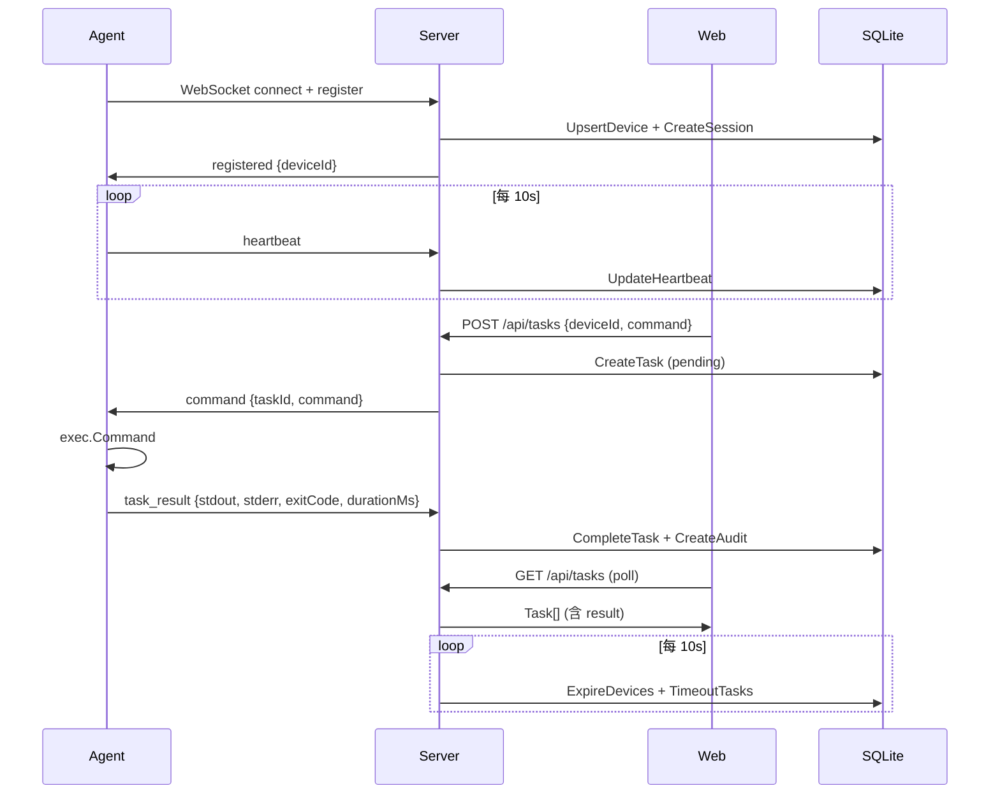

# LabOps 开源运维系统计划

> 状态：✅ MVP 已完成，57 个 Go 测试全部通过（Server 50 函数 + Agent 7 函数），Docker Compose 验证通过，全部审计修复完成（f067fec, cfbd94e, 45fe65f, R16-R23），AI Ops 已运行，安全加固完成（JWT 会话 / bcrypt / 强制改密 / TOCTOU），DB 索引已优化，WebSocket handler 已测试，GitHub Actions CI 已接入 · 日期：2026-07-09
> 本文件是 LabOps 项目的总体计划 SSOT（Single Source Of Truth）。各阶段的 design + tasks 拆分见对应 spec 目录。
> 工作流遵循 OpsService 的 `/spec-impl` 模式，适配 Go/React 技术栈后形成 LabOps 特有惯例。

## 1. Summary

做一个面向学生、实验室、Homelab 的轻量开源运维平台：

| 层 | 技术栈 | 说明 |
| --- | --- | --- |
| 前端 | React + TypeScript + Vite + Ant Design + Zustand | 延续 OpsService 前端风格 |
| 后端 | Go (stdlib net/http + gorilla/websocket + modernc/sqlite) | 替代 OpsService Java/Spring Boot DDD 架构 |
| Agent | Go (gorilla/websocket) | 后续可扩展 C++ Agent |
| 存储 | SQLite (MVP) → PostgreSQL (后期) | 降低 Windows 本地启动门槛 |
| 部署 | Docker Compose | 本地多容器模拟多设备 |

当前本地状态：

- 参考项目：`C:\Users\cowho\Desktop\code\Ops-Sys\OpsService`
- 新项目目录：`C:\Users\cowho\Desktop\code\Ops-Sys\LabOps`
- GitHub 链接：[cowhorse05/LabOps](https://github.com/cowhorse05/LabOps)
- 开发环境：**Windows + PowerShell + VS Code + Docker Desktop**

## 2. 项目结构

```text
LabOps/
├── web/              # React + TypeScript + Vite + Ant Design + Zustand
│   ├── src/
│   │   ├── api/      # axios client + API 函数 (client.ts, labops.ts)
│   │   ├── layouts/  # AppLayout (Sider + Header + Content)
│   │   ├── pages/    # Login, Dashboard, Devices, DeviceDetail, Groups, Tasks, Audit
│   │   ├── stores/   # Zustand auth store
│   │   ├── styles/   # global.css
│   │   ├── utils/    # status helpers + test
│   │   ├── types.ts  # 共享 TS 接口
│   │   ├── router.tsx # React Router 配置
│   │   └── main.tsx  # 入口
│   ├── dist/         # 构建产物
│   ├── Dockerfile    # Node dev 容器
│   ├── vite.config.ts
│   └── package.json
├── server/           # Go API server
│   ├── cmd/server/
│   │   └── main.go   # 入口 (env 读取、store 初始化、HTTP 启动)
│   ├── internal/core/
│   │   ├── types.go   # 领域类型 + 常量 + wire 协议
│   │   ├── store.go   # SQLite CRUD (devices, tasks, audit, users, sessions)
│   │   ├── app.go     # App 聚合根 (路由注册、CORS、auth、维护循环)
│   │   ├── api.go     # REST handler (health/login/stats/devices/groups/tasks/audit)
│   │   ├── agent.go   # WebSocket handler (注册、心跳、命令派发、结果回收)
│   │   └── store_test.go
│   ├── Dockerfile
│   └── go.mod
├── agent/            # Go Agent
│   ├── cmd/agent/
│   │   ├── main.go   # 入口 (flag 解析、connect loop、heartbeat、命令执行)
│   │   └── main_test.go
│   ├── Dockerfile
│   └── go.mod
├── deploy/           # 部署说明
│   └── README.md
├── docs/             # 文档
│   ├── master-plan.md   # 本文件 — 总体计划 SSOT
│   ├── product-plan.md  # 产品定位、MVP 范围、非目标
│   ├── research.md      # 外部平台 + OpsService 调研对比
│   ├── roadmap.md       # 版本路线图
│   ├── dev-log.md       # 开发日志（每阶段完成情况）
│   └── report.md        # 汇报版项目说明
├── scripts/          # Windows-first 开发脚本
│   ├── dev.ps1          # docker compose up --build
│   ├── test.ps1         # 构建检查 + Go test (Docker)
│   └── compose-down.ps1 # docker compose down
├── compose.yaml      # Docker Compose 多设备演示环境
└── README.md
```

## 3. 调研与对比

### 3.1 外部平台

调研对象：MeshCentral、Tactical RMM、Fleet、Portainer、Zabbix/Netdata、Apache Guacamole。

对比结论：

| 维度 | LabOps 决策 |
| --- | --- |
| Agent 远程管理 | 参考 MeshCentral，但不做全量 RMM |
| 任务执行/审计 | 参考 Tactical RMM，只做命令执行闭环 |
| 资产管理 | 参考 Fleet，保留设备详情 + 分组视图 |
| 容器模拟 | 参考 Portainer Docker 部署体验，但不做容器管理平台 |
| 指标/状态 | 参考 Zabbix/Netdata，做心跳 + 基础指标显示 |
| 远程桌面 | 后期研究路径，不进 MVP |

详细调研见 `research.md`。

### 3.2 本地 OpsService 参考

OpsService 结构：`client/` (C++17/Zeus), `server/` (Java/Spring Boot/DDD), `web/` (React/Vite/Ant Design)

| OpsService 做法 | LabOps 取舍 |
| --- | --- |
| C++ Windows Service client | MVP 用 Go Agent；C++ Agent 进 v0.4 roadmap |
| Java Spring Boot DDD 分层 | Go 单模块简化 (core 包聚合类型+store+api+agent) |
| MySQL + Redis | SQLite 单文件存储，降低部署门槛 |
| UDI / IoT 平台 / 私有 SDK | 全部不进入开源实现 |
| 远程桌面 (RDP/WebRTC) | MVP 不做，进 v0.4 调研 |
| React + Ant Design + Zustand 前端风格 | **完全延续** |
| 设备列表/详情/终端/文件推送/日志/审计 | 产品形态参考，MVP 做命令执行闭环 |
| GitLab CI | Docker Compose 本地开发流程 |

### 3.3 定位

LabOps 不是完整商用 RMM，而是"可本机演示的轻量运维控制平面"。

第一版重点是真实闭环：Agent 注册 → 心跳 → 资产上报 → 命令下发 → 结果回传 → 审计入库。

多设备通过 Docker 多容器模拟；K8s、sandbox、远程桌面放到后期。

## 4. 核心接口与数据流

### 4.1 REST API (Web → Server)

| Method | Path | Auth | 说明 |
| --- | --- | --- | --- |
| GET | `/api/health` | 无 | 健康检查 |
| POST | `/api/auth/login` | 无 | 登录，返回 token + user |
| GET | `/api/auth/me` | Bearer | 当前用户 |
| GET | `/api/stats` | Bearer | 设备统计 (total/online/offline) |
| GET | `/api/devices` | Bearer | 设备列表 |
| GET | `/api/devices/{id}` | Bearer | 设备详情 |
| GET | `/api/groups` | Bearer | 分组列表 (含 online/total) |
| GET | `/api/tasks` | Bearer | 任务列表 (含 result) |
| POST | `/api/tasks` | Bearer | 创建任务 `{deviceId?, groupName?, command}` |
| GET | `/api/tasks/{id}` | Bearer | 任务详情 |
| GET | `/api/audit-logs` | Bearer | 审计日志 |

Auth: `Authorization: Bearer <token>` header。Agent 路径 `/api/agent/ws` 和 `/api/health`、`/api/auth/login` 跳过鉴权。

### 4.2 WebSocket 协议 (Agent ↔ Server)

所有消息类型为 JSON envelope `{type, payload}`：

**Agent → Server**：

| type | payload | 时机 |
| --- | --- | --- |
| `register` | `RegisterPayload` (agentId, name, groupName, version, profile, hostname, os, ip, cpuCores, memoryMb, diskTotalGb) | 连接后第一条消息 |
| `heartbeat` | `HeartbeatPayload` (cpuUsage, memoryUsage, diskUsage) | 每 10s |
| `task_result` | `TaskResultPayload` (taskId, status, stdout, stderr, exitCode, durationMs) | 命令执行完成 |

**Server → Agent**：

| type | payload | 时机 |
| --- | --- | --- |
| `registered` | `{deviceId}` | 注册确认 |
| `command` | `CommandPayload` (taskId, command) | 用户创建命令任务 |
| `error` | `{message}` | 注册失败 |

### 4.3 数据流



### 4.4 数据模型

**Users**：`id, username, display_name, password, roles, created_at`
**Devices**：`id, name, group_name, profile, version, hostname, os, ip, cpu_cores, memory_mb, disk_total_gb, cpu_usage, memory_usage, disk_usage, status, last_seen, created_at, updated_at`
**Agent Sessions**：`id, device_id, remote_addr, connected_at, disconnected_at`
**Tasks**：`id, device_id, group_name, command, status, requested_by, created_at, started_at, finished_at`
**Task Results**：`task_id, stdout, stderr, exit_code, duration_ms, created_at`
**Audit Logs**：`id, actor, action, device_id, task_id, status, message, created_at`

Status 常量：`online/offline` (设备), `pending/running/success/failed/timeout` (任务)

## 5. 阶段 Todolist

### 阶段 0：调研与项目初始化 ✅

- [x] 创建 `docs/research.md`，记录外部平台与 `OpsService` 对比
- [x] 创建 `docs/product-plan.md`，明确 MVP、非目标、演示场景
- [x] 初始化本地 Git 仓库，并确认 GitHub remote
- [x] 创建基础目录、README、开发命令说明
- [x] 创建 `docs/roadmap.md` 版本路线图

### 阶段 1：最小真实闭环 ✅

- [x] Go Server：设备注册、心跳、任务创建、任务状态、审计日志
  - [x] `Store` 层 SQLite CRUD (6 表 schema, 15+ 方法)
  - [x] `App` 层路由注册、CORS、token 鉴权、维护循环
  - [x] `API` 层 10 个 REST handler
  - [x] `Agent` 层 WebSocket handler (register/heartbeat/command/task_result)
  - [x] **Round 1 fix**: UpsertDevice ON CONFLICT 补充 cpu/memory/disk_usage 列
- [x] Go Agent：支持 `--name`、`--group`、`--mock-profile`，主动连接 Server
  - [x] 注册协议 + 心跳循环 + 命令执行
  - [x] 4 种 mock profile (ubuntu/windows/server/edge)
  - [x] 自动重连 (3s 间隔)
  - [x] 单元测试：wsURL, register, executeCommand
  - [x] **Round 1 fix**: 心跳失败触发立即重连、空命令校验、error/unknown 消息处理
- [x] Web：设备列表、设备详情、命令执行、任务结果、审计页
  - [x] LoginPage (admin/admin) — **Round 1 fix**: 区分 401/5xx/网络错误
  - [x] DashboardPage (stats + 设备表格 + 在线率 + 最近任务/审计) — **Round 1 fix**: Promise.all → allSettled
  - [x] DevicesPage (搜索 + 自动刷新 10s)
  - [x] DeviceDetailPage (资产信息 + 实时指标 + 命令执行 + 最近任务)
  - [x] GroupsPage (分组列表 + 在线率)
  - [x] TasksPage (批量命令表单 + 任务表格 + stdout/stderr 展开) — **Round 1 fix**: initialValues 异步修复
  - [x] AuditPage (审计日志表格)
  - [x] Zustand auth store + axios interceptor
  - [x] 状态帮助函数 (statusColor/statusText) + 单元测试
  - [x] **Round 1 new**: ErrorBoundary 组件、useLoadable hook 基础
- [x] Docker Compose：启动 server、web、4 个 agent 容器模拟多设备
- [x] 基础设施 — **Round 1 new**: .dockerignore、.env.example、LICENSE、test.ps1 退出码检测

### 阶段 1.5：质量补全 ✅ (Round 1-4)

- [x] Web: ErrorBoundary (R1)、useLoadable hook (R1)、全页面迁移 (R2-R3)
- [x] Web: onError 接入 4 页面 (R4)、TypeScript 类型收窄 (R4)
- [x] Agent: 心跳错误重连 (R1)、指数退避 (R2)、panic recover (R2)、jitter 修复 (R2)
- [x] Server: UpsertDevice 修复 (R1)、newID 碰撞修复 (R2)、GetTask error (R2)、maintenance log (R4)
- [x] Infra: test.ps1 (R1)、.dockerignore (R1)、.env.example (R1)、LICENSE (R1)、Dockerfile HEALTHCHECK (R2)
- [x] Tests: store_test 扩展 9 用例 (R4)、agent_test 扩展 19 用例 (R4)、status.test (R0)

### 阶段 2：运维能力增强 🚧

**2.6 AI Ops 智能分析** ✅ (新增)
- [x] 服务端 `analyzer.go`：规则引擎分析设备状态
- [x] 分析维度：离线检测、CPU/内存/磁盘阈值、任务失败率
- [x] 设备健康评分 (0-100) + 分组聚合 + 告警计数
- [x] 每 30 分钟自动分析
- [x] Web 页面：仪表盘摘要、设备洞察卡片、分组概览表
- [x] API: `GET /api/aiops/report`

**2.1 设备分组与批量命令** ✅
- [x] 设备分组基于 Agent 注册时的 `--group` 参数
- [x] Web 按分组批量下发命令 (`POST /api/tasks` 支持 `groupName`)
- [x] 分组页面展示在线率

**2.2 心跳超时与离线状态** ✅
- [x] Server 维护循环每 10s 检查心跳超时 (35s timeout)
- [x] 超时设备自动标记 offline
- [x] Agent 断开时立即标记 offline + 写审计日志
- [x] Web 前端实时显示在线/离线状态

**2.3 Mock Profile 扩展** ✅
- [x] ubuntu: Ubuntu Desktop 24.04, 4C/4G/64G
- [x] windows-lab: Windows 11 Pro, 8C/16G/512G
- [x] server: Ubuntu Server 24.04, 4C/8G/128G
- [x] edge-node: Debian Edge Node, 2C/2G/32G
- [x] 每种 profile 有独立的 CPU/Memory/Disk 基线 + jitter

**2.4 文件分发** 🚧 (v0.3)
- [x] Design spec: `docs/features/file-distribution/design.md` + `tasks.md`
- [ ] 上传 + 分发 + SHA-256 校验 + 结果回传
- [ ] 下载任务产物

**2.5 Agent 日志采集** ⏳ (v0.3)
- [ ] Agent 端日志收集
- [ ] Server 端可查询日志

### 阶段 3：总结与展示 🚧

- [x] README 增加架构图、启动步骤、演示截图说明
- [x] 写 `docs/dev-log.md`：每阶段总结、完成项、未完成项、原因
- [x] 写 `docs/report.md`：面试/课程汇报版项目说明
- [x] 标记 Todo 完成情况，未完成项移动到 Roadmap
- [x] 演示环境完整验证（Go test ✅ 50+7 函数, Docker Compose ✅）
- [x] GitHub Actions CI 接入
- [x] 代码审计 3 中等问题修复（事务/索引/API 端点）
- [x] WebSocket handler 集成测试
- [x] v0.3 文件分发设计文档

### 测试状态更新

| 测试类型 | 状态 |
| --- | --- |
| Server Go 测试 (50 函数) | ✅ 全部通过 (Go 1.26.5, 2.7s) |
| Agent Go 测试 (7 函数) | ✅ 全部通过 (Go 1.26.5, 1.0s) |
| 前端 Vitest (1 函数) | ✅ 通过 |
| 前端 TypeCheck + Build | ✅ 通过 |
| 演示环境 (Server + Web 直连) | ✅ 可用 (:8090 + :5173) |
| Docker Compose 全流程 | ✅ 6 容器, 4 设备, 命令闭环验证通过 |

## 6. 核心工作流 (继承自 OpsService `/spec-impl`)

本工作流从 OpsService 的 `/spec-impl` command 适配而来，去掉 Java/JDK8/DDD 特有约束，保留核心流程骨架。

### 6.1 通用流程

1. **调研**：看外部平台、本地 `OpsService`、已有代码
2. **对比**：决定借鉴、简化、舍弃哪些能力
3. **Plan**：写清接口、页面、数据流、验收条件 → 产出 `design.md`
4. **Todolist**：拆小任务 → 产出 `tasks.md`
5. **开干**：后端 → Agent → 前端 → Compose
6. **验收**：跑测试 / 编译检查，记录结果
7. **总结**：记录实现内容和设计变化 → `implementation-notes.md`
8. **Todo 完成检查**：逐项标记 `[ ]`/`[~]`/`[x]`/`[!]`
9. **汇报**：更新 README、dev-log、report

### 6.2 任务勾选约定

| 标记 | 含义 |
| --- | --- |
| `[ ]` | 待办 |
| `[~]` | 进行中 |
| `[x]` | 已完成 |
| `[!]` | 阻塞 |

### 6.3 LabOps 专有硬约束

> 对应 OpsService 的 JDK8/DDD/@RequireAuth 约束，这是 LabOps 等效约束。

1. **Go 1.25**：server `go.mod` 声明 `go 1.25`，agent `go.mod` 声明 `go 1.23`。只用 Go 1.25 标准库 API，不引入实验性/unstable 包。
2. **无外部 Go 框架依赖**：server 只用 `net/http` + `gorilla/websocket` + `modernc/sqlite`。不引入 gin/echo/chi/gorilla mux 等 Web 框架，保持依赖最小化。
3. **单模块简洁架构**：Go 代码用 `internal/core` 单包聚合核心逻辑（types + store + app + api + agent），不强制 DDD 分层。新功能如需拆分，先评估是否真的需要新包。
4. **WebSocket 协议向后兼容**：envelope `{type, payload}` 结构不可变。新增 message type 只能追加 case，不能修改已有 type 的 payload schema。
5. **SQLite 迁移策略**：表结构变更通过 `Store.Init()` 中的 `CREATE TABLE IF NOT EXISTS` 追加。MVP 阶段不做 migration 框架；切 PostgreSQL 时再引入。
6. **前端类型安全**：改 `web/src/types.ts` 或后端 DTO 时，确保 Go struct 的 JSON tag 与 TS interface 字段对齐。Vite `tsc -b` 必须在 build 前通过。
7. **Windows-first 开发**：所有脚本优先 PowerShell。无需 WSL 即可完整开发。Docker 仅用于 Go 构建/测试和最终集成演示。
8. **不自动 git 操作**：未经明确要求不 `commit` / `push`；如在默认分支上要提交，先开分支。

### 6.4 Spec 目录约定

需要详细 spec 的功能，在 `docs/features/<name>/` 下创建：

```text
docs/features/<name>/
├── design.md            # 设计 SSOT（接口、数据流、验收条件）
├── tasks.md             # 任务清单（含 TDD 步骤声明）
└── implementation-notes.md  # 实现笔记（决策、偏差、风险）
```

当前项目规模较小（MVP），所有设计集中在本文档和各 `docs/*.md` 中，暂不拆分 feature spec 目录。阶段 2+ 的新功能（文件分发、C++ Agent 等）按此约定创建 spec。

### 6.5 停止条件

以下情况停止当前任务，标注状态后汇报，不要硬推：

- 测试反复失败、已尝试但无法修复 → 标 `[!]`，记录现象与已试方案
- 前置依赖无法满足（如 Docker 不可用、Go 未安装）→ 跳过，继续后面可做项
- 任务描述与代码现状严重矛盾 → 停下，先和用户对齐
- 需要 `git commit` / `push` → 不自动执行

## 7. Test Plan

### 7.1 MVP 验收标准

- [x] Windows 下能用 PowerShell 启动开发环境
- [x] `docker compose up` 后，前端能看到 4 台模拟设备在线
- [x] 停掉一个 Agent 容器后，设备进入离线或心跳超时状态
- [x] 前端对单台设备执行命令，能看到 stdout、stderr、exit code
- [x] 对设备组执行批量命令，每台设备有独立任务结果
- [x] 审计页能看到操作者、设备、命令、时间、结果
- [x] 重启 Server 后，设备、任务、审计记录仍可查询 (SQLite 持久化)

### 7.2 测试类型与状态

| 测试类型 | 目标 | 当前状态 |
| --- | --- | --- |
| Server Go 单测 | 注册、心跳、任务状态流转、审计写入 | ✅ `store_test.go` 通过 (in-memory SQLite) |
| Agent Go 单测 | wsURL、register profile、executeCommand | ✅ `main_test.go` 通过 |
| 前端 Vitest | status 工具函数 | ✅ `status.test.ts` 通过 |
| 前端 TypeCheck | `tsc -b` 类型检查 | ✅ 通过 |
| 前端 Build | `vite build` 构建 | ✅ 通过 |
| Docker Compose Config | `docker compose config` | ✅ 通过 |
| Docker Compose 全流程 | 完整命令闭环 | ✅ 6 容器, 4 设备, 命令闭环验证通过 |

### 7.3 阻塞项

当前无阻塞项。所有 Go 测试通过，Docker Compose 全流程验证通过。

## 8. Assumptions

- Windows 是默认开发环境；Docker Desktop 可用
- WSL 暂不作为主开发环境，除非后续 K8s/kind/k3d 明确需要
- 第一版不做 sandbox，只做 Docker 多容器模拟设备
- 第一版 Agent 用 Go；C++ Agent 作为 v0.4 进阶展示
- 本地 `OpsService` 只作为产品、架构、前端风格参考，不复制闭源依赖或私有业务代码
- GitHub 仓库 `cowhorse05/LabOps` 已配置为 remote
- **Go 本地测试已完成**：Server 34 测试函数 + Agent 7 测试函数全部通过，共 41 个 Go 测试通过
- Node.js 20+ 和 Docker Desktop 是本地可用的环境
- MVP 演示环境使用 4 个 Agent 容器（2 classroom + 1 homelab + 1 edge），满足"3 台以上"验收要求

## 9. 变更记录

| 版本 | 日期 | 变更内容 |
| --- | --- | --- |
| v0.1 | 2026-07-08 | 初始化总体计划；完成阶段 0-1 MVP 实现 |
| v0.2 | 2026-07-08 | 完善文档：追加项目结构详情、核心接口与数据流、工作流适配（继承 OpsService `/spec-impl`）、硬约束（Go 等效）、测试状态追踪、阻塞项记录 |
| v0.3 | 2026-07-09 | 更新状态为 MVP 完成；Go 约束从 1.23 提升至 1.25；更新测试计数（Server 34, Agent 7, 前端 1）；移除已解决的阻塞项；追加 AI Ops、安全加固（速率限制/bcrypt/X-Agent-Token/TOCTOU）和协作审计轮次信息 |
| v0.4 | 2026-07-09 | Round 16: SQL 事务包裹 FailTask/CompleteTask、DB 索引优化 (4 indexes)、DeviceDetailPage 专用 API 端点 (`GET /api/devices/{id}/tasks`)。测试计数更新至 Server 54 函数 + Agent 19 函数 |
| v0.5 | 2026-07-09 | Round 17: handleAgentWS WebSocket 集成测试 (5 新测试函数，含 token auth/register/heartbeat/disconnect)。Server 15 函数 + Agent 19 函数全部通过 |
| v0.6 | 2026-07-09 | Round 18: GitHub Actions CI workflow (`.github/workflows/ci.yml`)，3 并行 job：Server vet+test (go 1.25)、Agent vet+test (go 1.23)、Web tsc+build (node 20) |
| v0.7 | 2026-07-09 | Round 19: v0.3 文件分发 design spec + tasks.md、README 更新（CI badge、测试计数、特性列表）、master-plan 测试计数修正 (50+7)、下一步建议标记 |

## 10. 下一步建议

1. **补充截图**：截取 Dashboard/Devices/DeviceDetail/Tasks/Audit 页面放入 README
2. **v0.3 文件分发**：按 spec 约定创建 `docs/features/file-distribution/design.md` + `tasks.md`
3. ~~**CI 接入**~~ ✅ Round 18：GitHub Actions workflow 已添加，自动化 Go test + web build
4. **admin 密码 / 静态 Token**：安全加固，需 bcrypt 强制修改密码 + JWT 会话机制（架构变更，独立功能分支）
